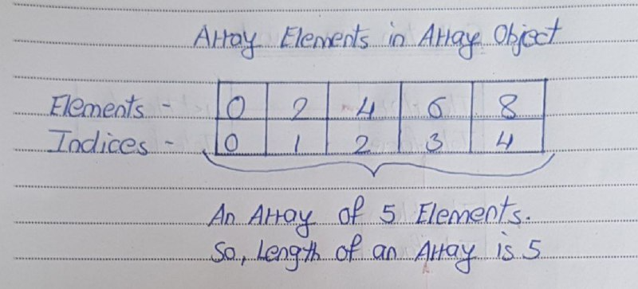

# Arrays in Java

- Array is a set of values where each value is identified by an index. 
- You can make an array of int’s, double’s, boolean’s or any other types but all the values of array must be of same type. 
- The index of an array starts from 0. 
- The following diagram shows how the array elements are stored in an array object.



## Declaring Arrays In Java

In java, you can declare arrays in two ways. Those two ways of declaring arrays in java are,
```
Data_Type[] Variable_Name;
```
AND
```
Data_Type Variable_Name[];
```
Note : As both styles of declaring arrays in java are valid but the style Data_Type[] Variable_Name is preferred. The style Data_Type Variable_Name[] comes from C/C++ and it is included in java to accommodate C/C++ programmers.

```
public class ArraysInJava
{
    public static void main(String[] args)
    {
        int[] arrayOfInts;    //Declaring an array of ints
 
        double arrayOfDoubles[];   //Declaring an array of doubles
 
        char[] arrayOfChars;     //Declaring an array of characters
 
        boolean arrayOfBooleans[];   //Declaring an array of booleans
    }
}
```

## Instantiating An Array Object

- In Java, arrays are created as objects. 
- Like objects, arrays are dynamically created & stored on the heap.
- Before creating an array object , JVM will load the array class in the method area.
- You can instantiate or create an array object using new operator. The syntax for instantiating arrays in java is,
```
Variable_Name = new Data_Type[ArraySize];
```

For example,
```
public class ArraysInJava
{
    public static void main(String[] args)
    {
        int[] arrayOfInts;      //Declaring an array of int
 
        arrayOfInts = new int[10];   //Instiantiating an array of int using new operator
     }
}
```
Note : When you create an array object of specified type and length with new operator, by default all array elements in the array object are initialized with default values.

## Initializing Array Elements

The syntax for initializing array elements is,
```
Variable_Name[index] = Value;
```

Note : Uninitialized array elements will get default values.
```
public class ArraysInJava
{
    public static void main(String[] args)
    {
        int[] arrayOfInts;      //Declaring an array of int
 
        arrayOfInts = new int[10];   //Instantiating an array of int using new operator
 
        arrayOfInts[2] = 12;         //Initializing 3rd element
 
        arrayOfInts[5] = 56;         //Initializing 6th element
    }
}
```

## Combining declaration, instantiate and initialization into one statement 

We can combine declaration, instantiate and initialization in one statement like below,
```
Data_Type[] Variable_Name = new Data_Type[] {Value0, Value1, Value2, Value3 ….. };
```

We should not mention array size here. If we mention array size, we will get compile time error.
```
public class ArraysInJava
{
    public static void main(String[] args)
    {
        //Declaring, instantiating and Initializing an array in one statement
 
        double[] arrayOfDoubles = new double[] {12.56, 45.87, 14.85};
 
        //This is also ok. 
 
        int[] arrayOfInts = {12, 21, 0, 5, 7};
    }
}
```

## Accessing Array Elements

Array elements are accessed through index of that element.
```
public class ArraysInJava
{
    public static void main(String[] args)
    {
        //Declaring and Initializing an array in one statement
 
        int[] arrayOfInts = {12, 21, 0, 5, 7};  
 
        System.out.println(arrayOfInts[0]);   //accessing 1st element
 
        System.out.println(arrayOfInts[3]);   //accessing 4th element
 
        System.out.println(arrayOfInts[2]);   //accessing 3rd element
    }
}
```