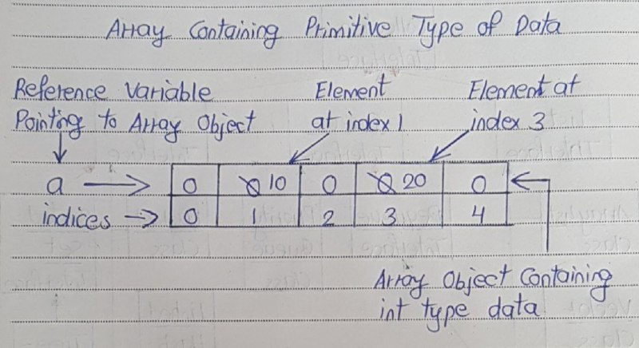
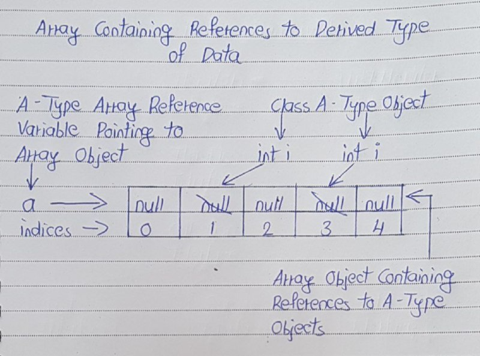

# Array Memory Storage

Internally, Arrays are like objects. That’s why they are created using new operator. Array objects can hold two types of data.

1) Primitive type of data

2) References to derived type of data.

## Array Containing Primitive Type Of Data

```
public class ArraysInJava
{
    public static void main(String[] args)
    {
        int[] a;           //Declaring int type array reference variable which will be referring to int type array object
 
        a = new int[5];    //Creating an int type Array Object containing 5 elements of int type
 
        a[1] = 10;         //Changing Value of element at index 1
 
        a[3] = 20;         //Changing Value of element at index 3
    }
}
```

In the above example, 
- First statement of main method (Line 5) declares an array reference variable of int type. 
- In the next statement, an array object containing 5 elements of int type is created and assigned to already declared array reference variable. 
- Initially, all elements of array are initialized with default values (i.e 0 in this example). 
- In the next statement (Line 9), Value of element at index 1 is changed to 10. 
- In the next statement, value of element at index 3 is changed to 20. 

This can be well explained with the diagram like below.


## Array Containing References To Derived Type Of Data 

```
class A
{
    int i;
}
 
public class ArraysInJava
{
    public static void main(String[] args)
    {
        A[] a;           //Declaring array reference variable of A-type which will be referring to an array object containing references to A-type objects
 
        a = new A[5];    //Creating an Array Object containing 5 references to A-type objects
 
        a[1] = new A();         //Creating an object of A-type and assigning it to element at index 1
 
        a[3] = new A();         //Creating an object of A-type and assigning it to element at index 3
    }
}
```

In the above example, 
- first statement of main method (Line 10) declares an array reference variable of class A-type. 
- This array reference variable must refer to an array object holding references to class A-type objects. 
- In the next statement, one array object which can hold 5 references to class A-type objects is created. Remember that, in this statement only an array object is created not 5 objects of class A-type are created . 
- Initially, all elements of array will be pointing to null. 
- In the next two statements (Line 14 and 16), two objects of class A-type are created and assigned to elements at index 1 and 3 respectively. 

It can be represented using diagram like below.
