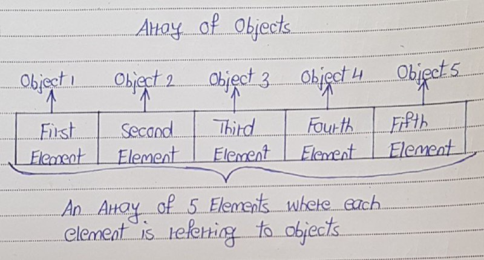

# Array of Objects in Java

- Array can hold the references to any type of objects. 
- It is important to note that array can contain only references to the objects, not the objects itself. 

This can be well explained with the diagram.


For example, In the below example ‘arrayOfUserDefinedTypeObjects‘ is an array containing only reference variables of type ‘UserDefinedType‘ type but not objects of ‘UserDefinedType’.
```
class UserDefinedType
{
    int i;
 
    void methodOne()
    {
        System.out.println("From User Defined Type Object");
    }
}
 
public class ArraysInJava
{
    public static void main(String[] args)
    {
        UserDefinedType[] arrayOfUserDefinedTypeObjects = new UserDefinedType[10];
 
        arrayOfUserDefinedTypeObjects[1].methodOne();    //This statement throws NullPointerException
 
        //because array elements are not initialized
    }
}
```
- The statement UserDefinedType[] arrayOfUserDefinedTypeObjects = new UserDefinedType[10]; creates an array which can hold references to 10 objects of ‘UserDefinedType’. 
- This statement does not create 10 objects of ‘UserDefinedType’. 
- We have to explicitly create the objects and assign to each element of the array. Otherwise, It gives NullPointerException at run time like in the above example.

To avoid the exception, create 10 objects and assign them to each element of array.
```
class UserDefinedType
{
    int i;
 
    void methodOne()
    {
        System.out.println("From User Defined Type Object");
    }
}
 
public class ArraysInJava
{
    public static void main(String[] args)
    {
        UserDefinedType[] arrayOfUserDefinedTypeObjects = new UserDefinedType[10];
 
        for (int i = 0; i < arrayOfUserDefinedTypeObjects.length; i++)
        {
            //Creating an object of 'UserDefinedType' and
            //assigning it to an element of array
 
            arrayOfUserDefinedTypeObjects[i] = new UserDefinedType();
        }
 
        arrayOfUserDefinedTypeObjects[1].methodOne();   //accessing member of 'UserDefinedType'
 
        //Now, above statement does not throw NullPointerException
    }
}
```

An array containing super class reference variables can point to sub class objects. For example,
```
class A
{
    int i;
 
    void methodOne()
    {
        System.out.println("From Class A");
    }
}
 
class B extends A
{
    @Override
    void methodOne()
    {
        System.out.println("From Class B");
    }
}
 
public class ArraysInJava
{
    public static void main(String[] args)
    {
        A[] arrayOfSuperClassReferences = new A[5];   //Defining an array of super class reference variables
 
        for (int i = 0; i < arrayOfSuperClassReferences.length; i++)
        {
            arrayOfSuperClassReferences[i] = new B();     //array element pointing to sub class object
 
            arrayOfSuperClassReferences[i].methodOne();   //accessing member of sub class object
        }
    }
}
```

