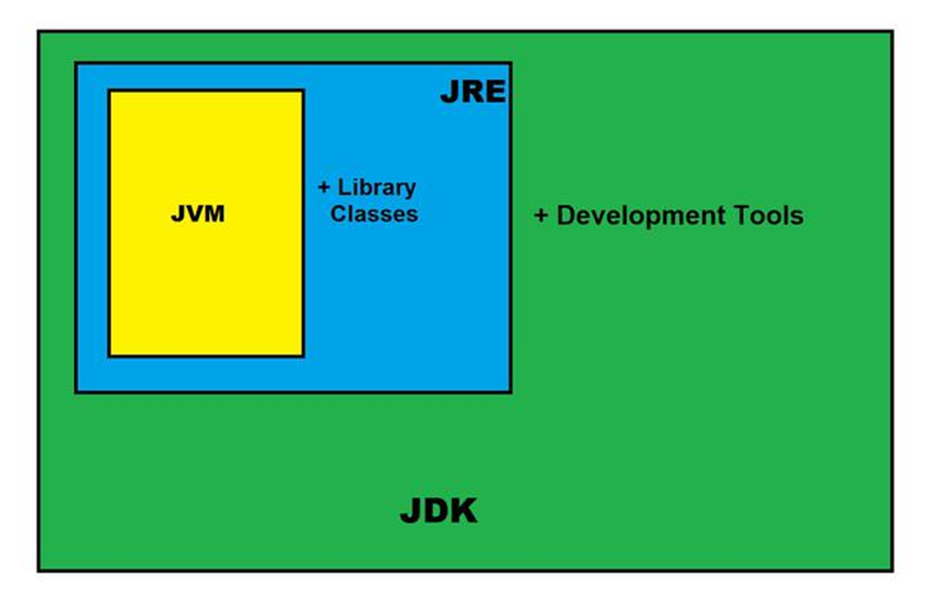

# JDK

- JDK stands for Java Development Kit or sometimes it is also referred as Java Standard Edition Development Kit. 
- JDK is a development environment to develop wide range of applications such as desktop applications, web applications or mobile applications using Java programming language.

## JRE

- JRE – Java Runtime Environment, is also part of JDK. 
- JRE provides the minimum runtime requirements for executing a java application. 
- It consists of Java Virtual Machine(JVM) executables, core classes and some supporting files.

## JDK

- The Java Development Kit (JDK) is a software development kit that includes everything developers need to develop, debug, and run Java applications. 
- It consists of the Java Runtime Environment (JRE), the Java compiler, and other tools and libraries.

Developers use the JDK to: 
- Compile Java source code into bytecode. 
- Run Java applications on their local machine. 
- Debug Java programs. 
- Package Java applications for distribution.

The Java Development Kit (JDK) is a cross-platformed software development environment that offers a collection of tools and libraries necessary for developing Java-based software applications and applets. It is a core package used in Java, along with the JVM (Java Virtual Machine) and the JRE (Java Runtime Environment).

Beginners often get confused with JRE and JDK, if you are only interested in running Java programs on your machine then you can easily do it using Java Runtime Environment. However, if you would like to develop a Java-based software application then along with JRE you may need some additional necessary tools, which is called JDK.

JDK= JRE + Development Tools

## Contents of JDK

The JDK has a private Java Virtual Machine (JVM) and a few other resources necessary for the development of a Java Application. 

JDK contains:
- Java Runtime Environment (JRE),
- An interpreter/loader (Java),
- A compiler (javac),
- An archiver (jar) and many more.

The  Java Runtime Environment in JDK is usually called Private Runtime because it is separated from the regular JRE and has extra content. The Private Runtime in JDK contains a JVM and all the class libraries present in the production environment, as well as additional libraries useful to developers, e.g, internationalization libraries and the IDL libraries.

Most Popular JDKs:
- Oracle JDK: the most popular JDK and the main distributor of Java11,
- OpenJDK: Ready for use: JDK 15, JDK 14, and JMC,
- Azul Systems Zing: efficient and low latency JDK for Linux os,
- Azul Systems: based Zulu brand for Linux, Windows, Mac OS X,
- IBM J9 JDK: for AIX, Linux, Windows, and many other OS,
- Amazon Corretto: the newest option with the no-cost build of OpenJDK and long-term support.

## The Jar component:

JDK contains many useful tools and among them, the most popular after javac is the jar tool. The jar file is nothing but a full pack of Java classes. After creating the .class files, you can put them together in a .jar, which compresses and structures them in a predictable fashion.

## Important Components of JDK

Below there is a comprehensive list of mostly used components of JDK which are very useful during the development of a java application.

| Component | Use | 
|:--------------:|:--------------:| 
| javac         |  Java compiler converts source code into Java bytecode         | 
| java | The loader of the java apps. |
| javap |  Class file disassembler |
| javadoc |  Documentation generator |
| jar | Java Archiver helps manage JAR files. |
| appletviewer | Debugging of Java applets without a web browser |
| xjc | Accepts an XML schema and generates Java classes |
| apt | Annotation-processing tool |
| jdb | Debugger |
| jmc | Java Mission Control |
| JConsole |   Monitoring and Management Console |
| pack200 | JAR compression tool, |
| extcheck | Utility tool to detects JAR file conflicts, |
| idlj | IDL-to-Java compiler, |
| keytool | The keystore manipulating tool |
| jstatd |  jstat daemon (experimental) |
| jstat | JVM statistics monitoring tool  |
| jshell | jshell introduced in java 9. |
| jstack | Prints Java stack traces(experimental) |
| jrunscript | Java command-line script shell |
| jhat | Java Heap Analysis Tool (experimental) |
| jpackage | Generate self-contained application bundles |
| javaws |  Web Start launcher for JNLP applications |
| javah | C header and stub generator |
| jarsigner |  jar signing and verification tool |
| jinfo | configuration information(experimental) |
| javafxpackager | Package and sign JavaFX applications |