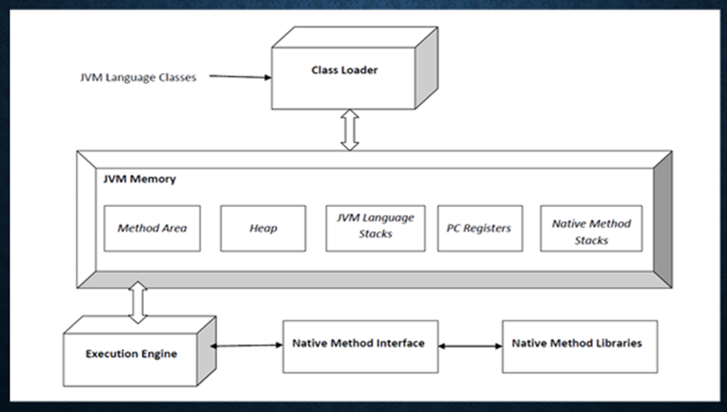
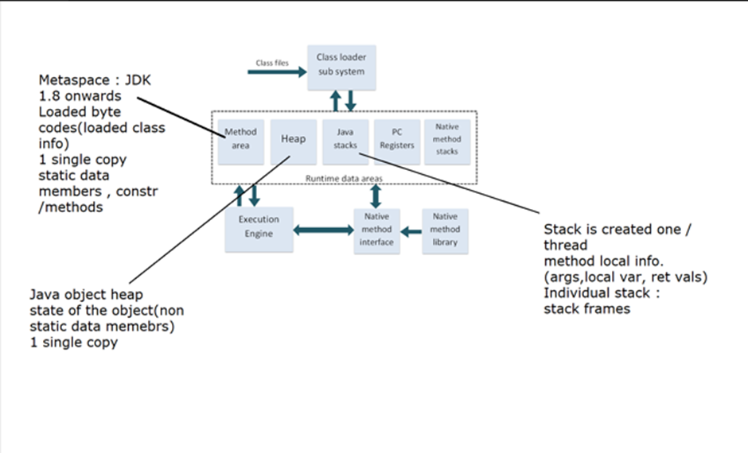
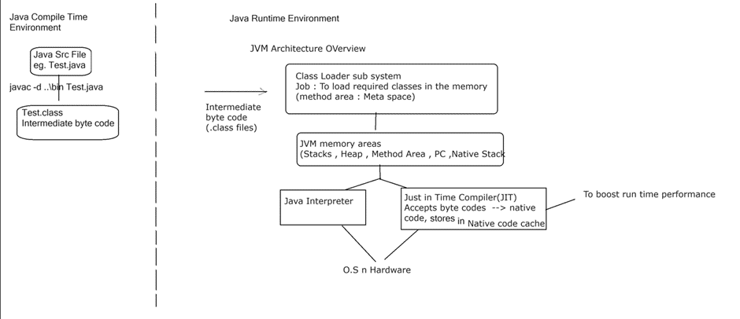
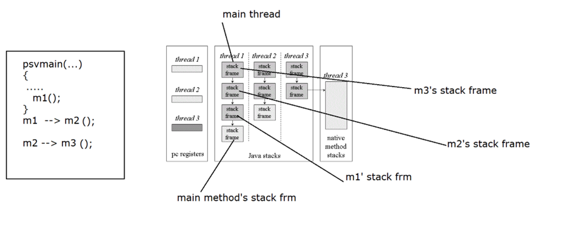

# JVM Architecture

- The Java Virtual Machine (JVM) is an abstract computing machine that provides a runtime environment in which Java bytecode can be executed. 
- It's responsible for executing Java programs by interpreting the bytecode and translating it into machine code that can be understood by the underlying hardware.

The JVM architecture consists of three main components:

- Class Loader: The class loader loads Java class files into memory as needed during program execution. 
- Runtime Data Area: The runtime data area is where the JVM stores data required for program execution, including the method area, heap, stack, and PC (Program Counter) register. 
- Execution Engine: The execution engine is responsible for executing Java bytecode by interpreting it or compiling it into native machine code.

1. Class loader sub system: JVM's class loader sub system performs 3 tasks
      - It loads .class file into memory.
      - It verifies byte code instructions.
      - It allocates memory required for the program.

2. Run Time Data Area: This is the memory resource used by JVM and it is divided into 5 parts :
- Method area: Method area stores class code and method code. (metaspace in Java SE 8)
- Heap: Objects are created on heap.
- Java stacks: Java stacks are the places where the Java methods are executed. A Java stack contains frames. On each frame, a separate method is executed.
- Program counter registers: The program counter registers store memory address of the instruction to be executed by the microprocessor.
- Native method stacks: The native method stacks are places where native methods (for example, C language programs) are executed. Native method is a function, which is written in another language other than Java.

3. Execution engine: Execution engine contains interpreter and JIT (Just in Time) compiler, which converts byte code into machine code. JVM uses optimization technique to decide which part to be interpreted and which part to be used with JIT compiler. The HotSpot represent the block of code executed by JIT compiler.

4. Native method interface: Native method interface is a program that connects native methods libraries (C header files) with JVM for executing native methods.

5. Native method library: holds the native libraries information.

## JVM Architecture

#### Class Loader

The JVM (Java Virtual Machine) class loader is a crucial component of the Java runtime environment responsible for loading Java classes into memory as they are referenced by a Java program. The class loader performs the following main functions: 

- Loading: The class loader loads bytecode (compiled Java classes) into memory from various sources such as files, network, or other locations. 
- Linking: After loading the bytecode, the class loader links the classes by verifying the bytecode, preparing it for execution (by allocating memory for class variables and initializing the memory to default values), and resolving symbolic references to other classes. 
- Initialization: Finally, the class loader initializes the class by executing static initializers and static variable initializations.

#### Method Area / Metaspace

JVM memory model that stores class structures, method information, and metadata. It's a shared resource among all the threads running within the JVM and is used to store data that doesn't change during the execution of the program. 

JVM method area stores: 

- Class Metadata: Information about classes, interfaces, methods, and fields, including method signatures, access modifiers, and structural details. 
- Static Fields: Shared among all instances of a class, stored in the method area. 
- Constant Pool: Contains symbolic references to classes, methods, and fields, as well as literal constants. 
- Bytecode: Stores the bytecode of methods. When a class is loaded, its bytecode is parsed and kept in the method area.

#### Heap and Stack

The "heap" refers to a specific area of memory where objects created by a Java program are stored. It's essentially a portion of memory dedicated to dynamically allocated memory for Java objects during runtime. 

The JVM language stack, often simply referred to as the "stack", is another important area of memory used for executing Java programs. It is utilized for 

- Method invocation 
- Stack frame 
- LIFO structure 
- Local variable and operation results

#### PC Registers and Native Method Stack

###### Program Counter (PC) Register: 

The Program Counter (PC) register is a special register within the JVM that holds the address of the currently executing instruction. It keeps track of the execution point within the bytecode of the currently executing method. 

#### Native Method Stack: 

The Native Method Stack is a memory area in the JVM used for executing native methods, which are methods written in languages other than Java (e.g., C, C++).

#### Execution Engine

The JVM execution engine is a crucial component responsible for executing Java bytecode instructions. It interprets the bytecode instructions and translates them into native machine code for the underlying hardware when necessary. 

In JDK 8 and later versions of the Java Virtual Machine (JVM), both interpretation and Just (JIT) compilation are used, employing what's known as a mixed-- In mode execution strategy.

- Interpreter: The interpreter is used initially to execute bytecode. When a Java application starts running, the JVM uses the interpreter to execute the bytecode instructions directly. This allows for quick startup and execution without waiting for compilation. 
- Just In Time (JIT) Compilation: As the application continues to run, the JVM identifies portions of code (hot spots) that are frequently executed. These hot spots are then compiled by the JIT compiler into optimized native machine code. This native code is then executed instead of interpreting the bytecode, resulting in improved performance for the frequently executed portions of the code. 

The JVM manages memory dynamically by allocating memory for new objects and reclaiming memory from objects that are no longer reachable or referenced by the application.

#### Native Methods Interface and Libraries

The Native Method Interface (JNI) and Native Method Libraries are mechanisms in Java that allow Java code to interact with code written in other programming languages, typically in C or C++. 

##### Native Method Interface (JNI): 

The JNI is a programming framework that enables Java code running in the JVM to call and be called by native applications and libraries written in other languages, such as C or C++. 

##### Native Method Libraries: 

Native method libraries are compiled libraries written in languages like C or C++ that contain implementations of native methods called from Java code.

## How Java Works

## Java Stacks

