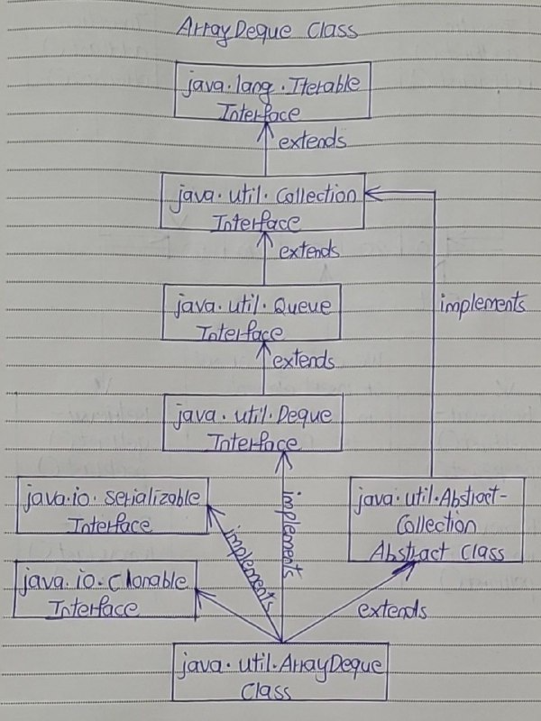

# ArrayDeque Class

- The ArrayDeque class in Java is introduced from JDK 1.6. 
- It is an implementation of Deque Interface which allows insertion of elements at both the ends. 
- It does not have any restrictions on capacity. 
- It expands automatically as we add more elements. 
- The ArrayDeque class extends AbstractCollection class and implements Deque interface. 
- It also implements Cloneable and Serializable marker interfaces.

Below is the hierarchy diagram of ArrayDeque class.



## Properties Of ArrayDeque Class 

1) Resizable

- ArrayDeque is a resizable-array implementation of Deque interface like ArrayList class which is a resizable-array implementation of List interface. 
- But, ArrayDeque is not a List.

2) Capacity

- ArrayDeque does not have any capacity limit. 
- It will grow automatically as we add elements.
- Default initial capacity of ArrayDeque is 16. 
- It will increase at a power of 2 (24, 25, 26 and so on) when size exceeds capacity.

3) Stack and Queue

- ArrayDeque can be used as a stack (LIFO) as well as a queue (FIFO). 
- ArrayDeque is faster than the Stack class when used as a stack and faster than the LinkedList class when used as a queue.

4) Performance

- Performance of ArrayDeque is sometimes considered as the best among the collection framework. 
- It gives performance of O(1) for insertion, removal and retrieval operations. ArrayDeque class is recommended instead of Stack class (when you want stack data structure) and instead of LinkedList class (when you want queue data structure).

5) Indexed Operations

- You can’t perform indexed operations on ArrayDeque. ArrayDeque doesn’t have the methods to support those operations.

6) Thread Safety

- ArrayDeque is not a thread safe.

## ArrayDeque Methods

# Methods of ArrayDeque Class

| **Category**              | **Method**                                 | **Description**                                                                         |
|---------------------------|--------------------------------------------|-----------------------------------------------------------------------------------------|
| **Adding Elements**        | `void add(E e)`                           | Adds an element at the end of the deque.                                                 |
|                           | `boolean offer(E e)`                      | Inserts the specified element at the end of the deque.                                   |
|                           | `void addFirst(E e)`                      | Inserts the specified element at the front of the deque.                                 |
|                           | `boolean offerFirst(E e)`                 | Inserts the specified element at the front of the deque.                                 |
|                           | `void addLast(E e)`                       | Inserts the specified element at the end of the deque.                                   |
|                           | `boolean offerLast(E e)`                  | Inserts the specified element at the end of the deque.                                   |
| **Removing Elements**      | `E remove()`                              | Retrieves and removes the first element.                                                 |
|                           | `E removeFirst()`                         | Retrieves and removes the first element.                                                 |
|                           | `E removeLast()`                          | Retrieves and removes the last element.                                                  |
|                           | `E poll()`                                | Retrieves and removes the first element, returns `null` if deque is empty.               |
|                           | `E pollFirst()`                           | Retrieves and removes the first element, returns `null` if deque is empty.               |
|                           | `E pollLast()`                            | Retrieves and removes the last element, returns `null` if deque is empty.                |
| **Retrieving Elements**    | `E getFirst()`                            | Retrieves, but does not remove, the first element.                                       |
|                           | `E getLast()`                             | Retrieves, but does not remove, the last element.                                        |
|                           | `E peek()`                                | Retrieves, but does not remove, the first element.                                       |
|                           | `E peekFirst()`                           | Retrieves, but does not remove, the first element.                                       |
|                           | `E peekLast()`                            | Retrieves, but does not remove, the last element.                                        |
| **Iterating Elements**     | `Iterator<E> iterator()`                  | Returns an iterator over the elements in this deque.                                     |
|                           | `Iterator<E> descendingIterator()`         | Returns an iterator over the elements in reverse order.                                  |
| **Checking Elements**      | `boolean contains(Object o)`              | Checks if the deque contains the specified element.                                      |
|                           | `boolean isEmpty()`                       | Checks if the deque is empty.                                                           |
|                           | `int size()`                              | Returns the number of elements in the deque.                                             |
| **Removing Specific Elements** | `boolean removeFirstOccurrence(Object o)` | Removes the first occurrence of the specified element.                                   |
|                           | `boolean removeLastOccurrence(Object o)`  | Removes the last occurrence of the specified element.                                    |
| **Clearing Elements**      | `void clear()`                            | Removes all elements from the deque.                                                     |


## Examples Of ArrayDeque class

1) ArrayDeque As Queue

```
public class ArrayDequeExample
{
    public static void main(String[] args)
    {
        //Creating an array deque
 
        ArrayDeque<String> arrayDeque = new ArrayDeque<String>();
 
        //Adding elements at the tail of arrayDeque
 
        arrayDeque.offer("One");
 
        arrayDeque.offer("Two");
 
        arrayDeque.offer("Three");
 
        arrayDeque.offer("Four");
 
        arrayDeque.offer("Five");
 
        //Printing the elements of arrayDeque
 
        System.out.println(arrayDeque);     //Output : [One, Two, Three, Four, Five]
 
        //Removing the elements from the head of arrayDeque
 
        System.out.println(arrayDeque.poll());    //Output : One
 
        System.out.println(arrayDeque.poll());    //Output : Two
    }
}
```

2) ArrayDeque As Stack

```
public class ArrayDequeExample
{
    public static void main(String[] args)
    {
        //Creating an array deque
 
        ArrayDeque<String> arrayDeque = new ArrayDeque<String>();
 
        //pushing elements into arrayDeque
 
        arrayDeque.push("One");
 
        arrayDeque.push("Two");
 
        arrayDeque.push("Three");
 
        arrayDeque.push("Four");
 
        arrayDeque.push("Five");
 
        //Printing the elements of arrayDeque
 
        System.out.println(arrayDeque);     //Output : [Five, Four, Three, Two, One]
 
        //popping up the elements from arrayDeque
 
        System.out.println(arrayDeque.pop());    //Output : Five
 
        System.out.println(arrayDeque.pop());    //Output : Four
    }
}
```