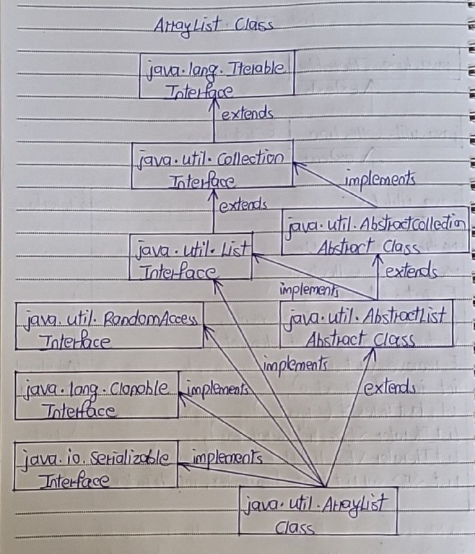

# ArrayList Class

- In java, normal arrays are of fixed length. 
- You can not change the size of arrays once they are defined. 
- That means, you must know in advance how large an array you want. 
- But sometimes, you may not know how large an array you want. 
- To overcome this situation, ArrayList is introduced in Collection framework.

## Drawbacks of Array

- Arrays are of fixed length. You can not change the size of the arrays once they are created.
- You can not accommodate an extra element in an array after they are created.
- Memory is allocated to an array during it’s creation only, much before the actual elements are added to it.

## What is an ArrayList

- ArrayList, in simple terms, can be defined as re-sizable array. 
- ArrayList is same like normal array but it can grow and shrink dynamically to hold any number of elements. 
- ArrayList is a sequential collection of objects which increases or decreases in size as we add or delete the elements.

## Elements in ArrayList

- In ArrayList, elements are positioned according to Zero-based index. 
- That means, elements are inserted from index 0. 
- Default initial capacity of an ArrayList is 10. 
- This capacity increases automatically as we add more elements to arraylist.
- You can also specify initial capacity of an ArrayList while creating it.

## Implementations of ArrayList

- ArrayList class implements List interface and extends AbstractList. 
- It also implements 3 marker interfaces – RandomAccess, Cloneable and Serializable. 

Here is hierarchy diagram of ArrayList class.




## Properties of ArrayList

1) Sixe of ArrayList

- Size of the ArrayList is not fixed. 
- It can increase and decrease dynamically as we add or delete the elements.
```
public class MainClass
{
    public static void main(String[] args)
    {
        //ArrayList with no size defined
 
        ArrayList<Integer> list = new ArrayList<>();
 
        //Adding elements to ArrayList
 
        list.add(10);
 
        list.add(20);
 
        list.add(30);
 
        list.add(40);
 
        System.out.println(list.size());     //Output : 4
 
        //Removing an element at index 0
 
        list.remove(0);
 
        System.out.println(list.size());    //Output : 3
    }
}
```

2) Null Elements

- ArrayList can have any number of null elements.
```
public class MainClass
{
    public static void main(String[] args)
    {
        ArrayList<Integer> list = new ArrayList<>();
 
        //Adding elements to ArrayList
 
        list.add(100);
 
        list.add(null);
 
        list.add(2000);
 
        list.add(null);
 
        list.add(null);
 
        //ArrayList having 3 null elements
 
        System.out.println(list);     //Output : [100, null, 2000, null, null]
    }
}
```

3) Duplicate Elements

- ArrayList can have duplicate elements.
```
public class MainClass
{
    public static void main(String[] args)
    {
        ArrayList<Integer> list = new ArrayList<>();
 
        //Adding elements to ArrayList
 
        list.add(100);
 
        list.add(100);
 
        list.add(100);
 
        list.add(100);
 
        //ArrayList having 4 duplicate elements
 
        System.out.println(list);     //Output : [100, 100, 100, 100]
    }
}
```

4) Set, Insert and Remove in ArrayList

- As ArrayList implements RandomAccess, you can get, set, insert and remove elements of the ArrayList from any arbitrary position.
```
public class MainClass
{
    public static void main(String[] args)
    {
        ArrayList<Integer> list = new ArrayList<>();
 
        //Adding elements to ArrayList
 
        list.add(10);
 
        list.add(20);
 
        list.add(30);
 
        list.add(40);
 
        System.out.println(list);     //Output : [10, 20, 30, 40]
 
        //Retrieving element at index 2
 
        System.out.println(list.get(2));     //Output : 30
 
        //Setting value of element at index 2
 
        list.set(2, 2222);
 
        System.out.println(list);      //Output : [10, 20, 2222, 40]
 
        //Inserting element at index 1
 
        list.add(1, 1111);
 
        System.out.println(list);     //Output : [10, 1111, 20, 2222, 40]
 
        //Removing element from index 3
 
        list.remove(3);
 
        System.out.println(list);    //Output : [10, 1111, 20, 40]
    }
}
```

5) Position of Elements

- When you insert an element in the middle of the ArrayList, the elements at the right side of that position are shifted one position right and when you delete an element, they will be shifted one position left. 
- This feature of the ArrayList causes some performance issues as shifting of elements is time consuming if ArrayList has lots of elements.

- Elements are placed according to Zero-based index. 
- That means, first element will be placed at index 0 and last element at index n-1, where ‘n’ is the size of the ArrayList.
```
public class MainClass
{
    public static void main(String[] args)
    {
        ArrayList<String> list = new ArrayList<String>();
 
        list.add("First");
 
        list.add("Second");
 
        list.add("Third");
 
        list.add("Fourth");
 
        System.out.println(list);    //Output : [First, Second, Third, Fourth]
    }
}
```

6) ArrayList is not synchronized

- ArrayList is not synchronized. 
- That means, multiple threads can use same ArrayList simultaneously.

7) Retrieve the position of that element.

- If you know the element, you can retrieve the position of that element.
```
public class MainClass
{
    public static void main(String[] args)
    {
        ArrayList<String> list = new ArrayList<String>();
 
        //Adding elements to ArrayList
 
        list.add("First");
 
        list.add("Second");
 
        list.add("Third");
 
        list.add("Fourth");
 
        System.out.println(list);    //Output : [First, Second, Third, Fourth]
 
        //Retrieving position of "Second" element
 
        System.out.println(list.indexOf("Second"));     //Output : 1
    }
}
```

8) ArrayList class has many methods to manipulate the stored objects

- ArrayList class has methods to perform solo modifications ( add(), remove()… ), bulk modifications ( addAll(), removeAll(), retainAll()… ), searching( indexOf(), lasIndexOf() ) and iterations( iterator() ).

9) If generics are not used, ArrayList can hold any type of objects.

```
class ArrayListDemo
{
    public static void main(String[] args)
    {
        ArrayList list = new ArrayList();     //ArrayList without generics
 
        list.add("ZERO");    //adding string type object
 
        list.add(1);        //adding primitive int type
 
        list.add(20.24);    //adding primitive double type
 
        list.add(new Float(23.56));   //Adding Float wrapper type object
 
        list.add(new Long(25));      //Adding Long wrapper type object
 
        System.out.println(list);     //Output : [ZERO, 1, 20.24, 23.56, 25]
    }
}
```

10) You can traverse an ArrayList in both the directions – forward and backward using ListIterator

```
class ArrayListDemo
{
    public static void main(String[] args)
    {   
        ArrayList<String> list = new ArrayList<String>();
         
        list.add("ONE");
         
        list.add("TWO");
         
        list.add("THREE");
         
        list.add("FOUR");
         
        ListIterator iterator = list.listIterator();
         
        System.out.println("Elements in forward direction");
         
        while (iterator.hasNext())
        {
            System.out.println(iterator.next());
        }
         
        System.out.println("Elements in backward direction");
         
        while (iterator.hasPrevious())
        {
            System.out.println(iterator.previous());
        }
    }
}
```

