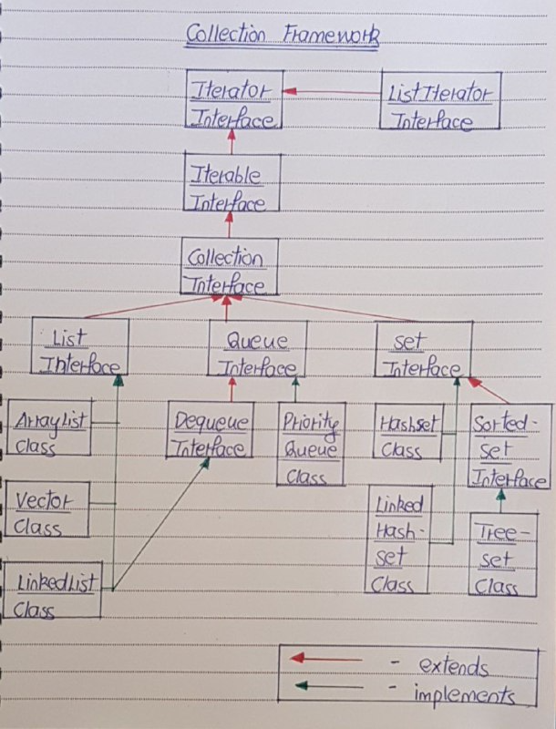
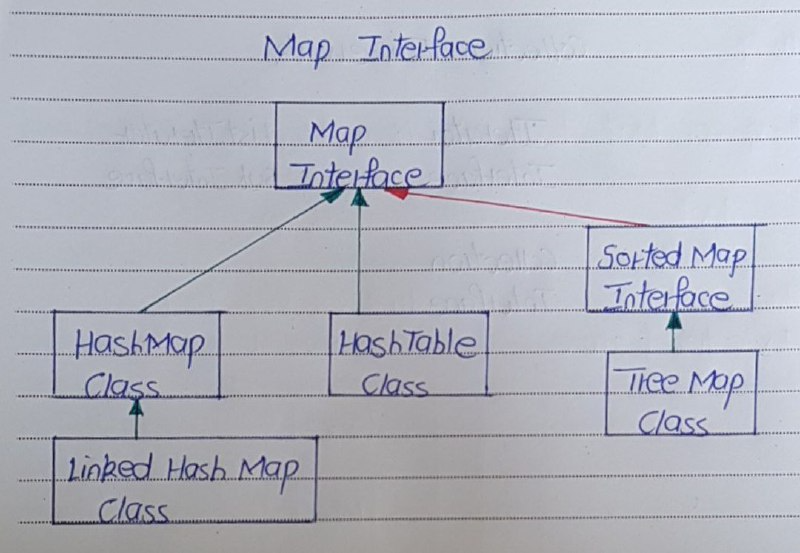

# Collection Framework

- Collections are nothing but group of objects stored in well defined manner. 
- Earlier, Arrays are used to represent these group of objects. But, arrays are not re-sizable. Size of the arrays are fixed. Size of the arrays can not be changed once they are defined. 
- This causes lots of problem while handling group of objects. 
- To overcome this drawback of arrays, Collection framework or simply collections are introduced in java from JDK 1.2.

## What is Collection Framework In Java ?

- Collection Framework in java is a centralized and unified theme to store and manipulate the group of objects. 
- Java Collection Framework provides some pre-defined classes and interfaces to handle the group of objects. 
- Using collection framework, you can store the objects as a list or as a set or as a queue or as a map and perform operations like adding an object or removing an object or sorting the objects without much hard work.

## Class Hierarchy Of Collection Framework

- All classes and interfaces related to Collection Framework are placed in java.util package. 
- java.util.Collection interface is at the top of class hierarchy of Collection Framework. Below diagram shows the class hierarchy of collection framework.

The entire collection framework is divided into four interfaces.

1) List  

- It handles sequential list of objects. 
- ArrayList, Vector and LinkedList classes implement this interface.

2) Queue 

- It handles the special group of objects in which elements are removed only from the head. 
- LinkedList and PriorityQueue classes implement this interface.

3) Set  

- It handles the group of objects which must contain only unique elements. 
- This interface is implemented by HashSet and LinkedHashSet classes and extended by SortedSet interface which in turn, is implemented by TreeSet.

4) Map  

- This is the one interface in Collection Framework which is not inherited from Collection interface. 
- It handles the group of objects as Key/Value pairs. 
- It is implemented by HashMap and HashTable classes and extended by SortedMap interface which in turn is implemented by TreeMap.

- Three of above interfaces (List, Queue and Set) inherit from Collection interface. 
- Although, Map is included in collection framework it does not inherit from Collection interface.

Detailed Overview of Collection Framework

1. Iterator

- Generic Interface
- java.util.Iterator<T>
- Cursor that can Traverse any Collection, in a Forward Manner

- Methods - 
1. public boolean hasNext()
2. public T next()
3. public void remove()

2. ListIterator

- Sub Interface of Iterator
- Extends from Iterartor
- List Specific (Can be Attached to only List Implementation Classes)
- java.util.List Method

- Methods - 
1. public ListIterartor<T> listIterator()
2. public ListIterartor<T> listIterator(int index)

3. Iterable

- Interface
- Extends from Iterartor
- java.lang.Iterable<T>
- T - Type of Element

- Methods - 

1. Iterator<T> iterartor()
2. Implicit Iterartor : for-each Loop

4. Collection

- Sub Interface of Iterable
- Collection<E>
- Feature : Doesn't import any specific behaviour - No Concrete Implementation Classes

- Method - 

1. add
2. addAll
3. remove
4. contains
5. toArray

