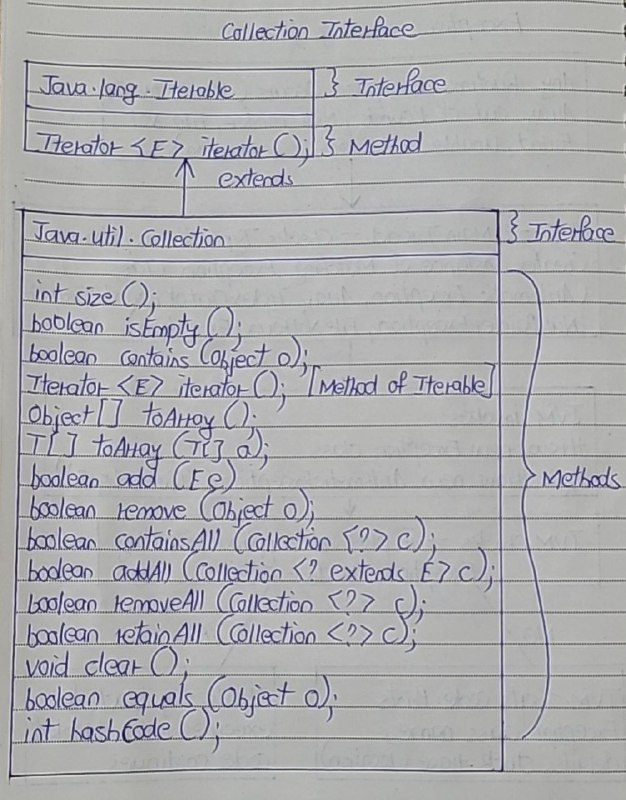

# Collection Interface

- Collection interface is the root level interface in the collection framework. 
- List, Queue and Set are all sub interfaces of Collection interface. 
- JDK does not provide any direct implementations of this interface. 
- But, JDK provides direct implementations of it’s sub interfaces.

- Collection interface extends Iterable interface which is a member of java.lang package. 
- Iterable interface has only one method called iterator(). 
- It returns an Iterator object, using that object you can iterate over the elements of Collection. 
- Here is the class diagram of Collection interface.

- Collection interface contains total 15 abstract methods. 
- 14 (2 Methods of toArray()) of it’s own and one is inherited from Iterable interface. 

Here is the list and descriptions of those methods.

1) size()	

- int size()
- Returns the number of elements in this collection

2) isEmpty()

- boolean isEmpty()
- Checks whether this collection is empty or not. If collection is empty, it returns true otherwise it returns false.

3) contains(Object o)

- boolean contains(Object o)
- Checks whether this collection has specified element.

4) iterator()

- Iterator<E> iterator()
- Returns an iterator over the elements in this collection.

5) toArray()

- Object[] toArray() 
- It returns an array containing all elements of this collection.

OR

- <T> T[] toArray(T[] a)
- It returns an array of specified type containing all elements of this collection.

6) add(E e)

- boolean add(E e)
- This method adds specified element to this collection. 
- It returns true if element is added successfully to the collection otherwise it returns false.

7) remove(Object o)

- boolean remove(Object o)
- Removes the specified element from this collection.

8) containsAll(Collection<?> c)

- boolean containsAll(Collection<?> c)
- It checks whether this collection contains all elements of passed collection.

9) addAll(Collection<? extends E> c)

- boolean addAll(Collection<? extends E> c)
- Adds all elements of the passed collection to this collection.

10) removeAll(Collection<?> c)

- boolean removeAll(Collection<?> c)
- Removes all elements of this collection which are also elements of passed collection.

11) boolean retainAll(Collection<?> c)

- boolean retainAll(Collection<?> c)
- Retains only those elements in this collection which are also elements of passed collection.

12) clear()

- void clear()
- Removes all elements in this collection.

13) equals(Object o)

- boolean equals(Object o)
- Compares the specified object with this collection for equality.

14) hashCode()

- int hashCode()
- Returns the hash code value of this collection.