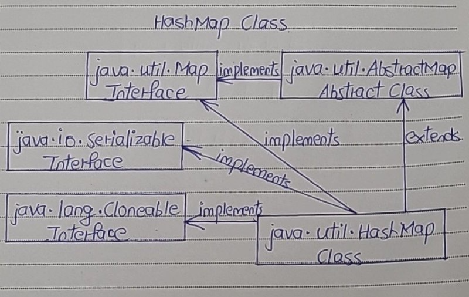

# HashMap Class.md

- The java.util.HashMap is a popular implementation of Map interface which holds the data as key-value pairs.
- HashMap extends AbstractMap class and implements Cloneable and Serializable marker interfaces. 
- AbstractMap is an abstract class which provides skeletal implementation of Map interface. 

Below is the hierarchy structure of java.util.HashMap class.



## Properties Of HashMap

1) Key - Value Pair

- HashMap holds the data in the form of key-value pairs where each key is associated with one value.

2) Duplicates

- HashMap doesn’t allow duplicate keys. But it can have duplicate values.

3) Null Values

- HashMap can have multiple null values and only one null key.

4) Synchronized

- HashMap is not synchronized. 
- To get the synchronized HashMap, use Collections.synchronizedMap() method.

5) Order

- HashMap maintains no order.

6) Performance

- HashMap gives constant time performance for the operations like get() and put() methods.

7) Capacity

-  Default initial capacity of HashMap is 16.

## Methods Of HashMap

| SL NO. | Methods                                      | Descriptions                                                                                                                                                            |
|--------|----------------------------------------------|------------------------------------------------------------------------------------------------------------------------------------------------------------------------|
| 1      | public V put(K key, V value)                 | Inserts specified key-value mapping in the map. If map already has a mapping for the specified key, then it rewrites that value with a new value.                        |
| 2      | public void putAll(Map m)                    | Copies all of the mappings of the map `m` to this map.                                                                                                                  |
| 3      | public V get(Object key)                     | Returns the value associated with a specified key.                                                                                                                      |
| 4      | public int size()                            | Returns the number of key-value pairs in this map.                                                                                                                      |
| 5      | public boolean isEmpty()                     | Checks whether this map is empty or not.                                                                                                                                |
| 6      | public boolean containsKey(Object key)       | Checks whether this map contains the mapping for the specified key.                                                                                                     |
| 7      | public boolean containsValue(Object value)   | Checks whether this map has one or more keys mapping to the specified value.                                                                                            |
| 8      | public V remove(Object key)                  | Removes the mapping for the specified key.                                                                                                                              |
| 9      | public void clear()                          | Removes all the mappings from this map.                                                                                                                                 |
| 10     | public Set<K> keySet()                       | Returns the Set view of the keys in the map.                                                                                                                            |
| 11     | public Collection<V> values()                | Returns the Collection view of the values in the map.                                                                                                                   |
| 12     | public Set<Map.Entry<K, V>> entrySet()       | Returns the Set view of all the mappings in this map.                                                                                                                   |
| 13     | public V putIfAbsent(K key, V value)         | Maps the given value with the specified key if this key is not associated with a value or is mapped to a null value.                                                     |
| 14     | public boolean remove(Object key, Object value) | Removes the entry for the specified key if it is currently mapped to the specified value.                                                                                |
| 15     | public boolean replace(K key, V oldValue, V newValue) | Replaces the old value of the specified key with the new value if the key is currently mapped to the old value.                                                          |
| 16     | public V replace(K key, V value)             | Replaces the current value of the specified key with the new value.                                                                                                      |


## HashMap Example

```
import java.util.HashMap;
import java.util.Iterator;
import java.util.Set;
  
public class JavaHashMapExample 
{    
    public static void main(String[] args) 
    {
        //Defining the HashMap
         
        HashMap<String, Double> map = new HashMap<String, Double>();
         
        //Adding some elements to HashMap
         
        map.put("Ashwin", 87.55);
         
        map.put("Bharat", 95.65);
         
        map.put("Chetan", 68.13);
         
        map.put("Dhanjay", 74.23);
         
        map.put("Kartik", 65.42);
         
        //HashMap can have one null key and multiple null values
         
        map.put(null, null);
         
        map.put("Sandesh", null);
         
        //Getting the size of the map
         
        System.out.println("Size Of The Map : "+map.size());
         
        System.out.println("-----------------");
         
        //Displaying the elements
         
        System.out.println("The elements are :");
         
        Set set = map.keySet();
         
        Iterator keySetIterator = set.iterator();
         
        while (keySetIterator.hasNext()) 
        {
            Object key = keySetIterator.next();
             
            System.out.println(key+"  : "+map.get(key));
        }
         
        System.out.println("-----------------");
         
        //Checking the map for a particular key/value
         
        System.out.println("Does this map has Chetan as key? "+map.containsKey("Chetan"));
         
        System.out.println("Does this map has 74.23 as value? "+map.containsValue(74.23));
         
        System.out.println("-----------------");
         
        //Removing an element from the map
         
        System.out.println("Value removed from the map : "+map.remove("Kartik"));
    }   
}
```

Output

```
Size Of The Map : 7
—————–
The elements are :
null : null
Ashwin : 87.55
Dhanjay : 74.23
Chetan : 68.13
Bharat : 95.65
Kartik : 65.42
Sandesh : null
—————–
Does this map has Chetan as key? true
Does this map has 74.23 as value? true
—————–
Value removed from the map : 65.42
```