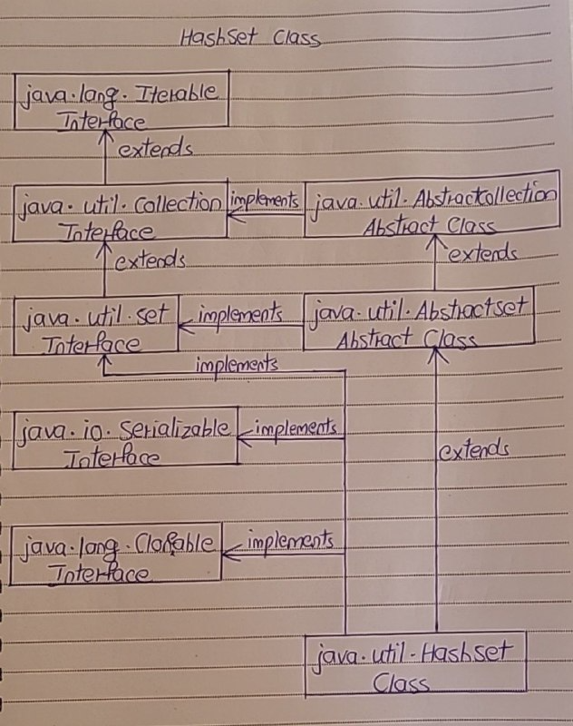

# HashSet Class

- The HashSet class in Java is an implementation of Set interface. 
- HashSet is a collection of objects which contains only unique elements. 
- Duplicates are not allowed in HashSet. 
- HashSet gives constant time performance for insertion, removal and retrieval operations. It allows only one null element.

- The HashSet internally uses HashMap to store the objects. 
- The elements you insert in HashSet will be stored as keys of that HashMap object and their values will be a constant called PRESENT. 
- This constant is defined as private static final Object PRESENT = new Object() in the source code of HashSet class.

- HashSet class extends AbstractSet class and implements Set interface. 
- It also implements Cloneable and Serializable marker interfaces. 

Below is the hierarchy diagram of HashSet class.



## Properties Of HashSet Class

1) Storing Objects

- HashSet class internally uses HashMap to store the objects. 
- The elements you enter into HashSet will be stored as keys of HashMap and their values will be a constant.

2) Duplicate Elements

- HashSet does not allow duplicate elements. 
- If you try to insert a duplicate element, older element will be overwritten.

```
public class HashSetExample
{
    public static void main(String[] args)
    {
        //Creating HashSet object
 
        HashSet<String> set = new HashSet<String>();
 
        //Adding elements to HashSet
 
        set.add("JAVA");
 
        set.add("JSP");
 
        set.add("STRUTS");
 
        set.add("HIBERNATE");
 
        set.add("JSP");
 
        set.add("JAVA");
 
        //Printing the elements of HashSet
 
        System.out.println(set);     //Output : [STRUTS, HIBERNATE, JSP, JAVA]
 
        //You can notice that duplicate elements are not added to HashSet
    }
}
```

3) Null Elements

- HashSet can have maximum one null element.

```
public class HashSetExample
{
    public static void main(String[] args)
    {
        //Creating HashSet object
 
        HashSet<String> set = new HashSet<String>();
 
        //Adding elements to HashSet
 
        set.add("ONE");
 
        set.add("TWO");
 
        set.add("THREE");
 
        set.add("FOUR");
 
        //Adding 3 null elements to hashSet
 
        set.add(null);
 
        set.add(null);
 
        set.add(null);
 
        //Printing the elements of HashSet
 
        System.out.println(set);     //Output : [null, ONE, TWO, THREE, FOUR]
 
        //You can notice that HashSet contains only one null element
    }
}
```

4) Order of Elements

- HashSet doesn’t maintain any order. 
- The order of the elements will be largely unpredictable. 
- And it also doesn’t guarantee that order will remain constant over time.

5) Performance

- HashSet offers constant time performance for insertion, removal and retrieval operations.

6) Synchronization

- HashSet class is not synchronized. 
- If you want synchronized HashSet, use Collections.synchronizedSet() method.

```
public class HashSetExample
{
    public static void main(String[] args)
    {
        //Creating HashSet object
 
        HashSet<String> set = new HashSet<String>();
 
        //Adding elements to HashSet
 
        set.add("BANGALORE");
 
        set.add("DELHI");
 
        set.add("CHENNAI");
 
        set.add("MUMBAI");
 
        set.add("AHMEDABAD");
 
        //getting synchronized set
 
        Set<String> syncSet = Collections.synchronizedSet(set);
    }
}
```

## HashSet Example

- Java HashSet is very powerful Collection type when you want a collection of unique objects. 
- HashSet doesn’t allow duplicate elements. 
- HashSet also gives constant time performance for insertion, removal and retrieval operations. 
- It is also important to note that HashSet doesn’t maintain any order. 
- So, It is recommended to use HashSet if you want a collection of unique elements and order of elements is not so important. 
- If you want your elements to be ordered in some way, you can use LinkedHashSet or TreeSet.

- Let’s create one HashSet of Student records where each Student record contains three fields – name, rollNo and department. 
- In these, rollNo will be unique for all students.

Let’s create Student class with three fields – name, rollNo and department.

```
class Student
{
    String name;
 
    int rollNo;
 
    String department;
 
    public Student(String name, int rollNo, String department)
    {
        this.name = name;
 
        this.rollNo = rollNo;
 
        this.department = department;
    }
 
    @Override
    public int hashCode()
    {
        return rollNo;
    }
 
    @Override
    public boolean equals(Object obj)
    {
        Student student = (Student) obj;
 
        return (rollNo == student.rollNo);
    }
 
    @Override
    public String toString()
    {
        return rollNo+", "+name+", "+department;
    }
}
```

- You can notice that hashCode() and equals() methods are overrided in the above class so that two Students objects will be compared solely based on rollNo. 
- That means, two Student objects having same rollNo will be considered as duplicates irrespective of other fields.

Create one HashSet object containing elements of Student type.
```
HashSet<Student> set = new HashSet<Student>();
```

Add some elements to this HashSet.
```
set.add(new Student("Avinash", 121, "ECE"));
 
set.add(new Student("Bharat", 101, "EEE"));
 
set.add(new Student("Malini", 151, "Civil"));
 
set.add(new Student("Suresh", 200, "IT"));
 
set.add(new Student("Vikram", 550, "CS"));
 
set.add(new Student("Bharat", 301, "IT"));
 
set.add(new Student("Amit", 301, "IT"));           //duplicate element
 
set.add(new Student("Bhavya", 872, "ECE"));
 
set.add(new Student("Naman", 301, "CS"));        //duplicate element
 
set.add(new Student("Samson", 565, "Civil"));
```

Iterate through this HashSet.
```
Iterator<Student> it = set.iterator();
 
while (it.hasNext())
{
    Student student = (Student) it.next();
 
    System.out.println(student);
}
```

Output will be,
```
550, Vikram, CS
565, Samson, Civil
101, Bharat, EEE
200, Suresh, IT
872, Bhavya, ECE
301, Bharat, IT
121, Avinash, ECE
151, Malini, Civil
```

- You can notice that duplicate elements are not added to HashSet.

Here is the whole program.
```
class Student
{
    String name;
 
    int rollNo;
 
    String department;
 
    public Student(String name, int rollNo, String department)
    {
        this.name = name;
 
        this.rollNo = rollNo;
 
        this.department = department;
    }
 
    @Override
    public int hashCode()
    {
        return rollNo;
    }
 
    @Override
    public boolean equals(Object obj)
    {
        Student student = (Student) obj;
 
        return (rollNo == student.rollNo);
    }
 
    @Override
    public String toString()
    {
        return rollNo+", "+name+", "+department;
    }
}
 
public class MainClass
{
    public static void main(String[] args)
    {
        HashSet<Student> set = new HashSet<Student>();
 
        //Adding elements to HashSet
 
        set.add(new Student("Avinash", 121, "ECE"));
 
        set.add(new Student("Bharat", 101, "EEE"));
 
        set.add(new Student("Malini", 151, "Civil"));
 
        set.add(new Student("Suresh", 200, "IT"));
 
        set.add(new Student("Vikram", 550, "CS"));
 
        set.add(new Student("Bharat", 301, "IT"));
 
        set.add(new Student("Amit", 301, "IT"));           //duplicate element
 
        set.add(new Student("Bhavya", 872, "ECE"));
 
        set.add(new Student("Naman", 301, "CS"));        //duplicate element
 
        set.add(new Student("Samson", 565, "Civil"));
 
        //Iterating through HashSet
 
        Iterator<Student> it = set.iterator();
 
        while (it.hasNext())
        {
            Student student = (Student) it.next();
 
            System.out.println(student);
        }
    }
}
```
