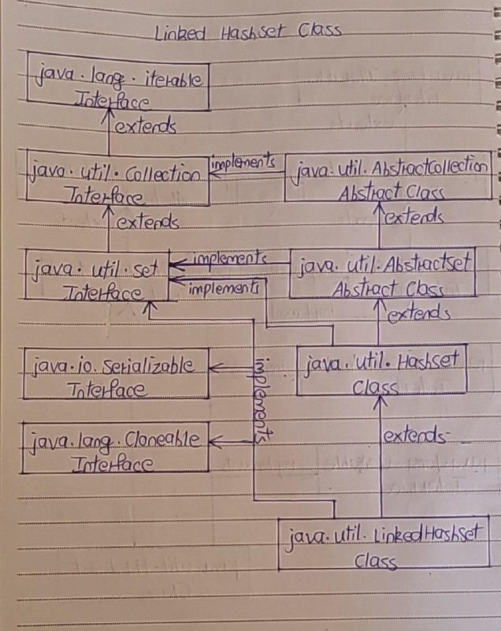

# LinkedHashSet Class

- The LinkedHashSet in java is an ordered version of HashSet which internally maintains one doubly linked list running through it’s elements. 
- This doubly linked list is responsible for maintaining the insertion order of the elements. 
- Unlike HashSet which maintains no order, LinkedHashSet maintains insertion order of elements. i.e elements are placed in the order they are inserted. 
- LinkedHashSet is recommended over HashSet if you want a unique collection of objects in an insertion order.

- The LinkedHashSet class extends HashSet class and implements Set interface. 
- It also implements Cloneable and Serializable marker interfaces. 

Below is the hierarchy diagram of LinkedHashSet class in java.



## Properties of LinkedHashSet Class

1) Storing Elements

- LinkedHashSet internally uses LinkedHashMap to store it’s elements just like HashSet which internally uses HashMap to store it’s elements.

2) Insertion Order

- LinkedHashSet maintains insertion order. This is the main difference between LinkedHashSet and HashSet.

```
public class LinkedHashSetExample
{
    public static void main(String[] args)
    {
        //Creating LinkedHashSet
 
        LinkedHashSet<String> set = new LinkedHashSet<String>();
 
        //Adding elements to LinkedHashSet
 
        set.add("JAVA");
 
        set.add("J2EE");
 
        set.add("STRUTS");
 
        set.add("JSP");
 
        set.add("JDBC");
 
        set.add("HIBERNATE");
 
        //Printing elements of LinkedHashSet
 
        System.out.println(set);     
 
        //Output : [JAVA, J2EE, STRUTS, JSP, JDBC, HIBERNATE]
 
        //Notice the order of elements. They are placed according to their insertion order.
    }
}
```

3) Performance

- LinkedhashSet also gives constant time performance for insertion, removal and retrieval operations. 
- The performance of LinkedHashSet is slightly less than the Hashset as it has to maintain doubly linked list internally to order it’s elements.

```
public class LinkedHashSetExample
{
    public static void main(String[] args)
    {
        //Creating LinkedHashSet
 
        LinkedHashSet<String> set = new LinkedHashSet<String>();
 
        //Adding elements to LinkedHashSet
 
        set.add("JAVA");
 
        set.add("J2EE");
 
        set.add("STRUTS");
 
        set.add("JSP");
 
        set.add("JDBC");
 
        set.add("HIBERNATE");
 
        //Getting Iterator object
 
        Iterator<String> it = set.iterator();
 
        //Modifying the LinkedHashSet after the Iterator is created
 
        set.add("JSF");
 
        while (it.hasNext())
        {
            //This statement will throw ConcurrentModificationException
 
            System.out.println(it.next());
        }
    }
}
```

4) Duplicate and Null Elements

- LinkedHashSet doesn’t allow duplicate elements and allows only one null element.

```
public class LinkedHashSetExample
{
    public static void main(String[] args)
    {
        //Creating LinkedHashSet
 
        LinkedHashSet<String> set = new LinkedHashSet<String>();
 
        //Adding elements to LinkedHashSet
 
        set.add("BLUE");
 
        set.add("RED");
 
        set.add("GREEN");
 
        set.add("BLUE");     //duplicate element
 
        set.add("BLACK");
 
        set.add("WHITE");
 
        //Adding two null elements
 
        set.add(null);
 
        set.add(null);
 
        //printing the elements of LinkedHashSet
 
        System.out.println(set);     //Output : [BLUE, RED, GREEN, BLACK, WHITE, null]
 
        //You can notice that LinkedHashSet doesn't allow duplicates and allows only one null element
    }
}
```

5) Synchronization

- LinkedHashSet is not synchronized. 
- To get the synchronized LinkedHashSet, use Collections.synchronizedSet() method.

## LinkedHashSet Example

- LinkedHashSet is an ordered version of HashSet. 
- That means, HashSet doesn’t maintain any order where as LinkedHashSet maintains insertion order of the elements. 
- LinkedHashSet uses doubly linked list internally to maintain the insertion order of it’s elements. 
- As LinkedHashSet maintains doubly linked list (along with HashMap), the performance of LinkedHashSet is slightly slower than the HashSet. 
- But, LinkedHashSet will be very useful when you need a collection of elements placed in the order they have inserted. 

- Let’s consider that you want to create a pool of customers placed in the order they have arrived. 
- Assume that it is also mandatory that duplicate customers must not be allowed. - For such requirements, LinkedHashSet is the best suitable. 

Let’s create Customer class with two fields – name and id.
```
class Customer
{
    String name;
 
    int id;
 
    public Customer(String name, int id)
    {
        this.name = name;
 
        this.id = id;
    }
 
    @Override
    public int hashCode()
    {
        return id;
    }
 
    @Override
    public boolean equals(Object obj)
    {
        Customer customer = (Customer) obj;
 
        return (id == customer.id);
    }
 
    @Override
    public String toString()
    {
        return id+" : "+name;
    }
}
```

- You might have observed that equals() and hashCode() methods in the above class are overrided so that Customer objects will be compared solely based on id. 
- That means two Customer objects having same id will be considered as duplicates and they will not be allowed in the pool.

Create one LinkedHashSet object containing elements of Customer type.
```
LinkedHashSet<Customer> set = new LinkedHashSet<Customer>();
```

Add some elements to this set.
```
set.add(new Customer("Jack", 021));
 
set.add(new Customer("Peter", 105));
 
set.add(new Customer("Ramesh", 415));    
 
set.add(new Customer("Julian", 814));
 
set.add(new Customer("Avinash", 105));      //Duplicate Element
 
set.add(new Customer("Sapna", 879));
 
set.add(new Customer("John", 546));
 
set.add(new Customer("Moni", 254));
 
set.add(new Customer("Ravi", 105));        //Duplicate Element
```

Iterate through this LinkedHashSet.
```
Iterator<Customer> it = set.iterator();
 
while (it.hasNext())
{
    Customer customer = (Customer) it.next();
 
    System.out.println(customer);
}
```

Output will be,
```
17 : Jack
105 : Peter
415 : Ramesh
814 : Julian
879 : Sapna
546 : John
254 : Moni
```

- You can notice that Customer objects are placed in the order they are inserted into the set and also duplicate elements are avoided.


Below is the code for the whole program.
```
class Customer
{
    String name;
 
    int id;
 
    public Customer(String name, int id)
    {
        this.name = name;
 
        this.id = id;
    }
 
    @Override
    public int hashCode()
    {
        return id;
    }
 
    @Override
    public boolean equals(Object obj)
    {
        Customer customer = (Customer) obj;
 
        return (id == customer.id);
    }
 
    @Override
    public String toString()
    {
        return id+" : "+name;
    }
}
 
public class MainClass
{
    public static void main(String[] args)
    {
        //Creating LinkedHashSet
 
        LinkedHashSet<Customer> set = new LinkedHashSet<Customer>();
 
        //Adding elements to LinkedHashSet
 
        set.add(new Customer("Jack", 021));
 
        set.add(new Customer("Peter", 105));
 
        set.add(new Customer("Ramesh", 415));    
 
        set.add(new Customer("Julian", 814));
 
        set.add(new Customer("Avinash", 105));      //Duplicate Element
 
        set.add(new Customer("Sapna", 879));
 
        set.add(new Customer("John", 546));
 
        set.add(new Customer("Moni", 254));
 
        set.add(new Customer("Ravi", 105));        //Duplicate Element
 
        //Getting Iterator object
 
        Iterator<Customer> it = set.iterator();
 
        while (it.hasNext())
        {
            Customer customer = (Customer) it.next();
 
            System.out.println(customer);
        }
    }
}
```
