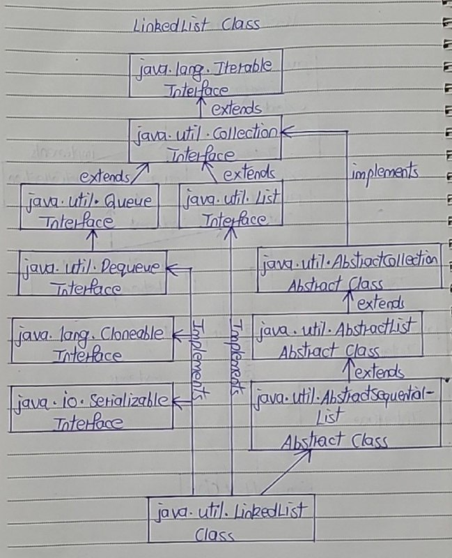
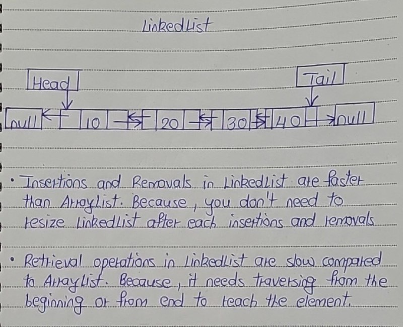

# LinkedList Class

- In general terms, LinkedList is a data structure where each element consist of three things. 
- First one is the reference to previous element, second one is the actual value of the element and last one is the reference to next element.

- The LinkedList class in Java is an implementation of doubly linked list which can be used both as a List as well as Queue. 
- The LinkedList in java can have any type of elements including null and duplicates. 
- Elements can be inserted and can be removed from both the ends and can be retrieved from any arbitrary position.

- The LinkedList class extends AbstractSequentialList and implements List and Deque interfaces. 
- It also implements 2 marker interfaces – Cloneable and Serializable. 

Here is the hierarchy diagram of LinkedList class in Java.

## Properties Of LinkedList Class

1) Elements in the LinkedList 

- Elements in the LinkedList are called as Nodes. 
- Where each node consist of three parts – Reference To Previous Element, Value Of The Element and Reference To Next Element. 
- Below diagram shows how LinkedList looks like.

- Reference To Previous Element of first node and Reference To Next Element of last node are null as there will be no elements before the first node and after the last node.
- LinkedList can have multiple null elements.
- LinkedList can have duplicate elements.

2) Insert Methods

- You can insert the elements at both the ends and also in the middle of the LinkedList. 
- Below is the list of methods for insertion operations.

| Insertion At Head | Insertion In The Middle | Insertion At Tail |
|:--------------:|:--------------:|:--------------:|
| addFirst(E e) | add(int index, E e) | add(E e) |
| offerFirst(E e) | addAll(int index, Collection c) | addAll(Collection c) |
|  |  | offer(E e) |
|  |  | offerLast(E e) |

3) Remove Methods

- You can remove the elements from the head, from the tail and also from the middle of the LinkedList.
- Below is the list of removal methods.

| Removing from head | Removing from the middle | Removing from the tail |
|:--------------:|:--------------:|:--------------:|
| poll() | Remove(int index) | pollLast() |
| pollFirst() |  | removeLast() |
| remove() |  |  |
| removeFirst() |  |  |

4) Retrieve Methods

- You can retrieve the elements form the head, from the middle and from the tail of the LinkedList. 
- Below is the list of retrieval methods.

| Retrieving from the head | Retrieving from the middle | Retrieving from the tail |
|:--------------:|:--------------:|:--------------:|
| element() | get(int index) | getLast() |
| getFirst() |  | peekLast() |
| peek() |  |  |
| peekFirst() |  |  |

5) Insertion and Removal Compared to ArrayList

- Insertion and removal operations in LinkedList are faster than the ArrayList. 
- Because in LinkedList, there is no need to shift the elements after each insertion and removal. 
- Only references of next and previous elements need to be changed.

6) Retrieval Compared to ArrayList

- Retrieval of the elements is very slow in LinkedList as compared to ArrayList. - Because in LinkedList, you have to traverse from beginning or end (whichever is closer to the element) to reach the element.

7) LinkedList and Stack and Other Classes

- The LinkedList can be used as stack. It has the methods pop() and push() which make it to function as Stack.
- The LinkedList can also be used as ArrayList, Queue, Singly linked list and doubly linked list.

8) Random Access

- LinkedList class in Java is not of type Random Access. i.e the elements can not be accessed randomly. 
- To access the given element, you have to traverse the LinkedList from beginning or end (whichever is closer to the element) to reach the given element.
