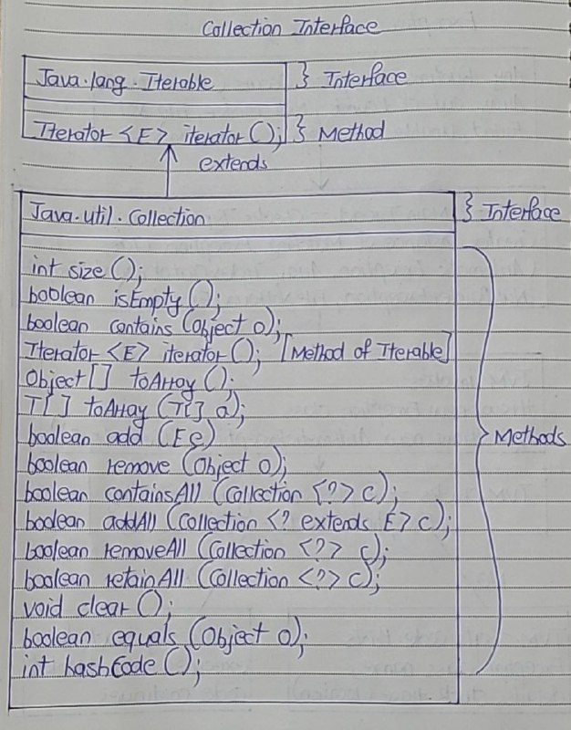
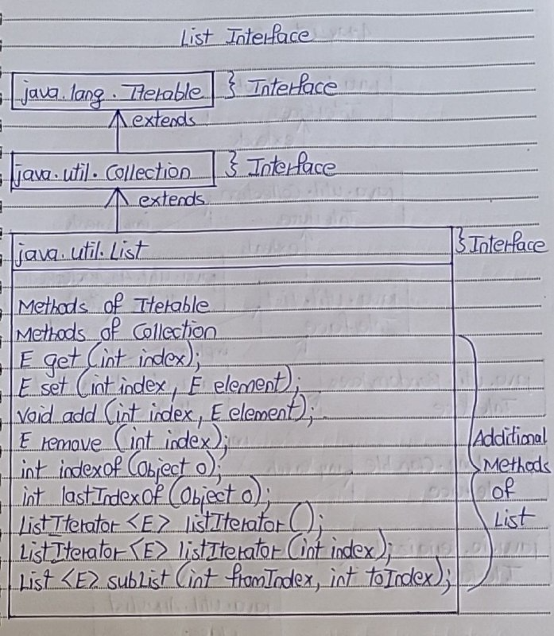

# List Interface

- List Interface represents an ordered or sequential collection of objects. 
- This interface has some methods which can be used to store and manipulate the ordered collection of objects. 
- The classes which implement the List interface are called as Lists. 
- ArrayList, Vector and LinkedList are some examples of lists. 
- You have the control over where to insert an element and from where to remove an element in the list.

## Properties of Lists

- Elements of the lists are ordered using Zero based index.
- You can access the elements of lists using an integer index.
- Elements can be inserted at a specific position using integer index. Any pre-existing elements at or beyond that position are shifted right.
- Elements can be removed from a specific position. The elements beyond that position are shifted left.
- A list may contain duplicate elements.
- A list may contain multiple null elements.

- List interface extends Collection interface. 
- So, All 15 methods of Collection interface are inherited to List interface. 
- Along with these methods, another 9 methods are included in the List interface to support the properties of lists. 

Here is the class diagram 

- Diagram of Collection Interface

- Diagram of List Interface

## Methods of List Interface

- There are 9 additional methods included in List interface along with the methods inherited from Collection Interface. 
- Here is the list and the details of those methods.

1) get(int index)

- E get(int index)
- Returns element at the specified position.

2) set(int index, E element)

- E set(int index, E element)
- Replaces an element at the specified position with the passed element.

3) add(int index, E element)

- void add(int index, E element)
- Inserts passed element at a specified index.

4) remove(int index)

- E remove(int index)
- Removes an element at specified index.

5) indexOf(Object o)

- int indexOf(Object o)
- It returns an index of first occurrence of passed object.

6) lastIndexOf(Object o)

- int lastIndexOf(Object o)
- It returns an index of last occurrence of passed object.

7) listIterator()

- ListIterator<E> listIterator()
- It returns a list iterator over the elements of this list.

8) listIterator(int index)

- ListIterator<E> listIterator(int index)
- Returns a list iterator over the elements of this list starting from the specified index.

9) subList(int fromIndex, int toIndex)

- List<E> subList(int fromIndex, int toIndex)
- Returns sub list of this list starting from ‘fromIndex’ to ‘toIndex’.