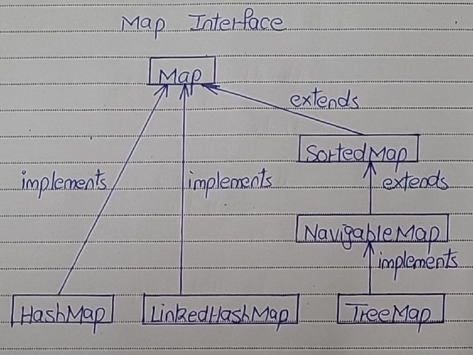

# Map Interface

- The Map interface in java is one of the four top level interfaces of Java Collection Framework along with List, Set and Queue interfaces. 
- But, unlike others, it doesn’t inherit from Collection interface. 
- Instead it starts it’s own interface hierarchy for maintaining the key-value associations. 
- Map is an object of key-value pairs where each key is associated with a value. 
- This interface is the replacement for ‘Dictionary‘ class which is an abstract class introduced in JDK 1.0.

- HashMap, LinkedHashMap and TreeMap are three popular implementations of Map interface. 

Below picture shows the hierarchy of Map interface in java.

## Properties Of Map Interface 

1) Relation with Collection Framework

- Map interface is a part of Java Collection Framework, but it doesn’t inherit Collection Interface.

2) Key - Value Pair

- Map interface stores the data as a key-value pairs where each key is associated with a value.

3) Duplicates

- A map can not have duplicate keys but can have duplicate values.

4) Key and Value Relation

- Each key at most must be associated with one value.

5) Storage of Key - Value Pairs

- Each key-value pairs of the map are stored as Map.Entry objects. 
- Map.Entry is an inner interface of Map interface.

6) Implementations of Map Interface

- The common implementations of Map interface are HashMap, LinkedHashMap and TreeMap.

7) Order of Elements 

- Order of elements in map is implementation dependent. 
- HashMap doesn’t maintain any order of elements. 
- LinkedHashMap maintains insertion order of elements. 
- Where as TreeMap places the elements according to supplied Comparator.

8) Methods

- The Map interface provides three methods, which allows map’s contents to be viewed as a 
- set of keys - keySet() method, 
- collection of value - values() method, 
- set of key-value mappings - entrySet() method.

## Methods Of Map Interface

| SL NO. | Methods                                      | Descriptions                                                                                                    |
|--------|----------------------------------------------|----------------------------------------------------------------------------------------------------------------|
| 1      | int size()                                   | Returns number of key-value pairs in this map.                                                                  |
| 2      | boolean isEmpty()                            | Checks whether this map is empty or not.                                                                        |
| 3      | boolean containsKey(Object key)              | Returns true if this map contains a mapping for the specified key.                                              |
| 4      | boolean containsValue(Object value)          | Returns true if this map contains one or more keys associated with the specified value.                         |
| 5      | V get(Object key)                            | Returns value associated with the specified key.                                                                |
| 6      | V put(K key, V value)                       | Adds the specified key-value pair to this map. If the specified key already exists, the old value will be replaced by the specified value. |
| 7      | V remove(Object key)                        | Removes the specified key along with its value from this map.                                                   |
| 8      | void putAll(Map<? extends K, ? extends V> m) | Copies all key-value pairs from the specified map to this map.                                                  |
| 9      | void clear()                                 | Removes all mappings from this map.                                                                             |
| 10     | Set<K> keySet()                              | Returns a set containing all keys of this map. The returned set is backed by the actual map.                    |
| 11     | Collection<V> values()                       | Returns a collection of values of this map. The returned collection is backed by the actual map.                |
| 12     | Set<Map.Entry<K, V>> entrySet()              | Returns set view of the mappings contained in this map.                                                         |
| 13     | boolean equals(Object o)                     | Compares the specified object with this map.                                                                    |
| 14     | int hashCode()                               | Returns hashcode value of this map.                                                                             |
