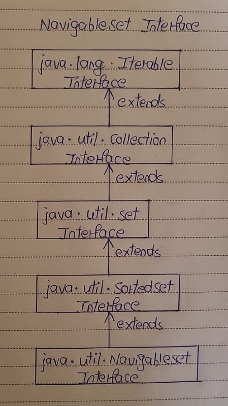

# NavigableSet Interface

- The NavigableSet is a SortedSet with navigation facilities. 
- The NavigableSet interface provides many methods through them you can easily find closest matches of any given element. 
- It has the methods to find out less than, less than or equal to, greater than and greater than or equal of any element in a SortedSet.
- The NavigableSet interface extends SortedSet interface. 

Here is the hierarchy diagram of NavigableSet Interface.

## Methods Of NavigableSet Interface 

| SL NO. |      NavigableSet Interface Methods      | Description                                                                 |
|:------:|:----------------------------------------:|:---------------------------------------------------------------------------:|
|   1    | E lower(E e)                             | Returns greatest element in this set which is strictly less than the given element. |
|   2    | E floor(E e)                             | Returns greatest element in this set which is less than or equal to the given element. |
|   3    | E ceiling(E e)                           | Returns the least element in this set which is greater than or equal to the given element. |
|   4    | E higher(E e)                            | Returns the least element in this set which is strictly greater than the given element. |
|   5    | E pollFirst()                            | Retrieves and removes the first element in this set.                        |
|   6    | E pollLast()                             | Retrieves and removes last element in this set.                             |
|   7    | NavigableSet<E> descendingSet()          | Returns reverse order view of this set.                                     |
|   8    | Iterator<E> descendingIterator()         | Returns an iterator over the elements of this set in descending order.      |
|   9    | NavigableSet<E> subSet(E fromElement, boolean fromInclusive, E toElement, boolean toInclusive) | Returns a view of this set whose elements are in the range from ‘fromElement’ to ‘toElement’. |
|  10    | NavigableSet<E> headSet(E toElement, boolean inclusive) | Returns a view of this set whose elements are in the range from first element of this set to ‘toElement’. |
|  11    | NavigableSet<E> tailSet(E fromElement, boolean inclusive) | Returns a view of this element whose elements are in the range from ‘fromElement’ to last element of this set. |

## Properties Of NavigableSet Interface

1) Null and Duplicate Elements

- NavaigableSet can’t have null elements.
- NavigableSet doesn’t support duplicate elements.

2) Traversal

- NavigableSet can be traversed and accessed in either ascending or descending order.

3) Methods

- Methods subSet(), headSet() and tailSet() differ from SortedSet interface in taking additional arguments describing whether upper bound and lower bound are inclusive or exclusive.
