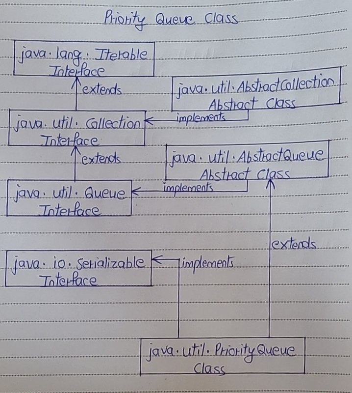

# Priority Queue Class

- The PriorityQueue is a queue in which elements are ordered according to specified Comparator. 
- You have to specify this Comparator while creating a PriorityQueue itsel. 
- If no Comparator is specified, elements will be placed in their natural order. 
- The PriorityQueue is a special type of queue because it is not a First-In-First-Out (FIFO) as in the normal queues. 
- But, elements are placed according to supplied Comaparator.

- The PriorityQueue does not allow null elements. 
- Elements in the PriorityQueue must be of Comparable type, If you insert the elements which are not Comparable, you will get ClassCastException at run time.

- PriorityQueue class extends AbstractQueue class which in turn implements Queue interface. 
- PriorityQueue also implements one marker interface – java.io.Serializable interface. 

Below is the hierarchy diagram of PriorityQueue class.



## Properties Of Priority Queue Class

1) Order of Elements

- Elements in the PriorityQueue are ordered according to supplied Comparator. 
- If Comparator is not supplied, elements will be placed in their natural order.

2) Duplicate and Null Elements

- The PriorityQueue can have duplicate elements but can not have null elements.

3) Capacity

- The PriorityQueue is unbounded. 
- That means the capacity of the PriorityQueue increases automatically if the size exceeds capacity. 
- But, how it grows is not specified.
- The default initial capacity of PriorityQueue is 11.

4) Comparable Type

- All elements of the PriorityQueue must be of Comparable type. 
- Otherwise ClassCastException will be thrown at run time.

5) Largest and Least Element

- The head element of the PriorityQueue is always the least element and tail element is always the largest element according to specified Comparator.

6) Comparator 

- You can retrieve the Comparator used to order the elements of the PriorityQueue using comparator() method.

7) Thread Safe

- PriorityQueue is not a thread safe.


## PriorityQueue Example

- Java collections are of great use when you are dealing with a group of objects. 
- Some times you need to process the group of objects on a priority basis. 
- You may need to order them on a particular criteria. 
- For example, you may want to order employee records in the ascending order of their salaries or you may want to order the customers on their id’s. 
- In such scenarios, PriorityQueue is of great help.

Taking Two examples of PriorityQueue – One with the default Comparator and another one with the customized comparator.

## PriorityQueue With Default Comparator

- We already know that if we don’t supply the Comparator while creating a PriorityQueue, elements will be ordered in natural ascending order. 
- In this example, we create a PriorityQueue of Integers without supplying a Comparator like this,

```
PriorityQueue<Integer> pQueue = new PriorityQueue<Integer>();
```

- As we are not passing any Comparator, elements of ‘pQueue‘ will be placed in the ascending order. 
- Let’s add some elements to this PriorityQueue.

```
pQueue.offer(21);
 
pQueue.offer(17);
 
pQueue.offer(37);
 
pQueue.offer(41);
 
pQueue.offer(9);
 
pQueue.offer(67);
 
pQueue.offer(31);
```

- We know that head element of the PriorityQueue always will be the least element. 
- Let’s remove the elements of ‘pQueue’ one by one using poll() method ( poll() method removes the head of the queue ).

```
System.out.println(pQueue.poll());     //Output : 9
 
System.out.println(pQueue.poll());     //Output : 17
 
System.out.println(pQueue.poll());     //Output : 21
 
System.out.println(pQueue.poll());     //Output : 31
 
System.out.println(pQueue.poll());     //Output : 37
 
System.out.println(pQueue.poll());     //Output : 41
 
System.out.println(pQueue.poll());     //Output : 67
```

- Notice that always the least element is removed from the ‘pQueue’. 
- That means elements in the ‘pQueue’ are placed in the ascending order.

Complete Code - 

```
public class PriorityQueueExample
{
    public static void main(String[] args)
    {
        //Creating a PriorityQueue with default Comparator.
 
        PriorityQueue<Integer> pQueue = new PriorityQueue<Integer>();
 
        //Inserting elements into pQueue.
 
        pQueue.offer(21);
 
        pQueue.offer(17);
 
        pQueue.offer(37);
 
        pQueue.offer(41);
 
        pQueue.offer(9);
 
        pQueue.offer(67);
 
        pQueue.offer(31);
 
        //Removing the head elements
 
        System.out.println(pQueue.poll());     //Output : 9
 
        System.out.println(pQueue.poll());     //Output : 17
 
        System.out.println(pQueue.poll());     //Output : 21
 
        System.out.println(pQueue.poll());     //Output : 31
 
        System.out.println(pQueue.poll());     //Output : 37
 
        System.out.println(pQueue.poll());     //Output : 41
 
        System.out.println(pQueue.poll());     //Output : 67
    }
}
```

## PriorityQueue With Customized Comparator

- We create a PriorityQueue with our own Comparator. 
- We try to create a PriorityQueue of ‘Employee‘ objects ordered in the ascending order of their salaries. 
- That means head element always will be an ‘Employee‘ object with lowest salary.

- Let’s define ‘Employee’ class with two attributes –  ‘name’ and ‘salary’.

```
class Employee
{
    String name;
 
    int salary;
 
    //Constructor Of Employee
 
    public Employee(String name, int salary)
    {
        this.name = name;
 
        this.salary = salary;
    }
 
    @Override
    public String toString()
    {
        return name+" : "+salary;
    }
}
```

- In the above class, toString() method is overrided so that it returns the contents of the object.

- Let’s define our own Comparator class ‘MyComparator‘ which compares the salary of two Employees.

```
class MyComparator implements Comparator<Employee>
{
    @Override
    public int compare(Employee e1, Employee e2)
    {
        return e1.salary - e2.salary;
    }
}
```

- Let’s create a PriorityQueue of ‘Employee’ objects with ‘MyComparator‘ as a Comparator.

```
MyComparator comparator = new MyComparator();
 
PriorityQueue<Employee> pQueue = new PriorityQueue<Employee>(7, comparator);
```

- Let’s insert some ‘Employee’ objects into ‘pQueue’.

```
pQueue.offer(new Employee("AAA", 15000));
 
pQueue.offer(new Employee("BBB", 12000));
 
pQueue.offer(new Employee("CCC", 7500));
 
pQueue.offer(new Employee("DDD", 17500));
 
pQueue.offer(new Employee("EEE", 21500));
 
pQueue.offer(new Employee("FFF", 29000));
 
pQueue.offer(new Employee("GGG", 14300));
```

- Let’s remove the head elements of the ‘pQueue’ one by one.

```
System.out.println(pQueue.poll());       //Output --> CCC : 7500
 
System.out.println(pQueue.poll());       //Output --> BBB : 12000
 
System.out.println(pQueue.poll());       //Output --> GGG : 14300
 
System.out.println(pQueue.poll());       //Output --> AAA : 15000
 
System.out.println(pQueue.poll());       //Output --> DDD : 17500
 
System.out.println(pQueue.poll());       //Output --> EEE : 21500
 
System.out.println(pQueue.poll());       //Output --> FFF : 29000
```

- You can notice that always an Employee of lowest salary is removed. 
- That means, head element always contains Employee object with lowest salary. 
- ‘Employee‘ objects in ‘pQueue‘ are placed in the ascending order of their salary.

Complete Code - 

```
//Employee Class
 
class Employee
{
    String name;
 
    int salary;
 
    //Constructor Of Employee
 
    public Employee(String name, int salary)
    {
        this.name = name;
 
        this.salary = salary;
    }
 
    @Override
    public String toString()
    {
        return name+" : "+salary;
    }
}
 
//MyComparator Class
 
class MyComparator implements Comparator<Employee>
{
    @Override
    public int compare(Employee e1, Employee e2)
    {
        return e1.salary - e2.salary;
    }
}
 
public class PriorityQueueExample
{
    public static void main(String[] args)
    {
        //Instantiating MyComaparator
 
        MyComparator comparator = new MyComparator();
 
        //Creating PriorityQueue of Employee objects with MyComparator as Comparator
 
        PriorityQueue<Employee> pQueue = new PriorityQueue<Employee>(7, comparator);
 
        //Adding Employee objects to pQueue
 
        pQueue.offer(new Employee("AAA", 15000));
 
        pQueue.offer(new Employee("BBB", 12000));
 
        pQueue.offer(new Employee("CCC", 7500));
 
        pQueue.offer(new Employee("DDD", 17500));
 
        pQueue.offer(new Employee("EEE", 21500));
 
        pQueue.offer(new Employee("FFF", 29000));
 
        pQueue.offer(new Employee("GGG", 14300));
 
        //Removing the head elements
 
        System.out.println(pQueue.poll());       //Output --> CCC : 7500
 
        System.out.println(pQueue.poll());       //Output --> BBB : 12000
 
        System.out.println(pQueue.poll());       //Output --> GGG : 14300
 
        System.out.println(pQueue.poll());       //Output --> AAA : 15000
 
        System.out.println(pQueue.poll());       //Output --> DDD : 17500
 
        System.out.println(pQueue.poll());       //Output --> EEE : 21500
 
        System.out.println(pQueue.poll());       //Output --> FFF : 29000
    }
}
```