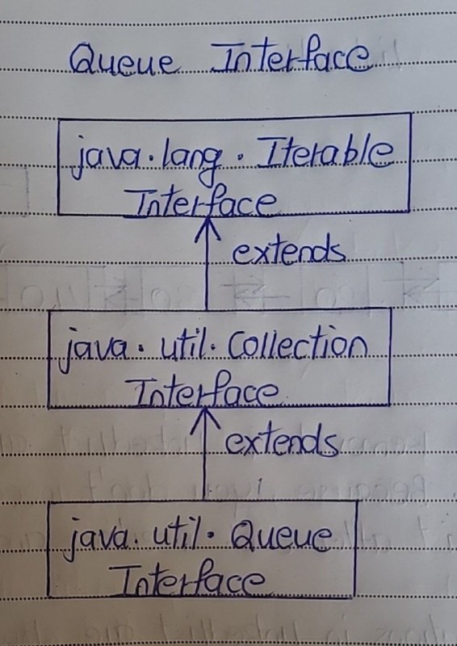
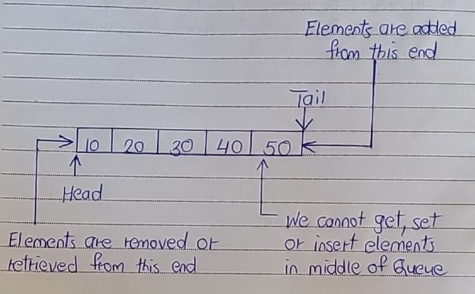

# Queue Interface

- The Queue Interface extends Collection interface. 
- It defines queue data structure which is normally First-In-First-Out. 
- Queue is a data structure in which elements are added from one end and elements are deleted from another end. 
- But, exception being the Priority Queue in which elements are removed from one end, but elements are added according to the order defined by the supplied comparator. 

Here is the hierarchy diagram of Queue interface.

## Woring of Queue

- Queue is a data structure where elements are added from one end called tail of the queue and elements are removed from another end called head of the queue. 
- Queue is also first-in-first-out type of data structure (except priority queue). 
- That means an element which is inserted first will be the first element to be removed from the queue. 
- You can’t add or get or set elements at an arbitrary position in the queues. 

## Properties Of Queue

1) Null Elements

- Null elements are not allowed in the queue. 
- If you try to insert null object into the queue, it throws NullPointerException.

2) Duplicate Elements

- Queue can have duplicate elements.

3) Random Access

- Unlike a normal list, queue is not random access. i.e you can’t set or insert or get elements at an arbitrary positions.

4) Insert, Remove and Retrieve

- In most of cases, elements are inserted at one end called tail of the queue and elements are removed or retrieved from another end called head of the queue.

5) Methods to Obtain and Remove the Elements

- In the Queue Interface, there are two methods to obtain and remove the elements from the head of the queue. 
- They are poll() and remove(). 
- The difference between them is, poll() returns null if the queue is empty and remove() throws an exception if the queue is empty.

6) Methods to Obtain the Elements but don’t Remove

- There are two methods in the Queue interface to obtain the elements but don’t remove. 
- They are peek() and element(). 
- peek() returns null if the queue is empty and element() throws an exception if the queue is empty.

## Methods Of Queue Interface

- Here are the methods of Queue interface. 
- Some of the methods throw an exception if operation is not possible and some methods return a value (null or false) if operation is not possible.

| Operation | Throws An Exception If operation is not possible | Returns null or false if operation is not possible |
|:--------------:|:--------------:|:--------------:|
| Add an element to the queue | add() | offer() |
| Retrieve an element from the head of the queue | element() | peek() |
| Retrieve And Remove an element from the head of the queue | remove() | poll() |
