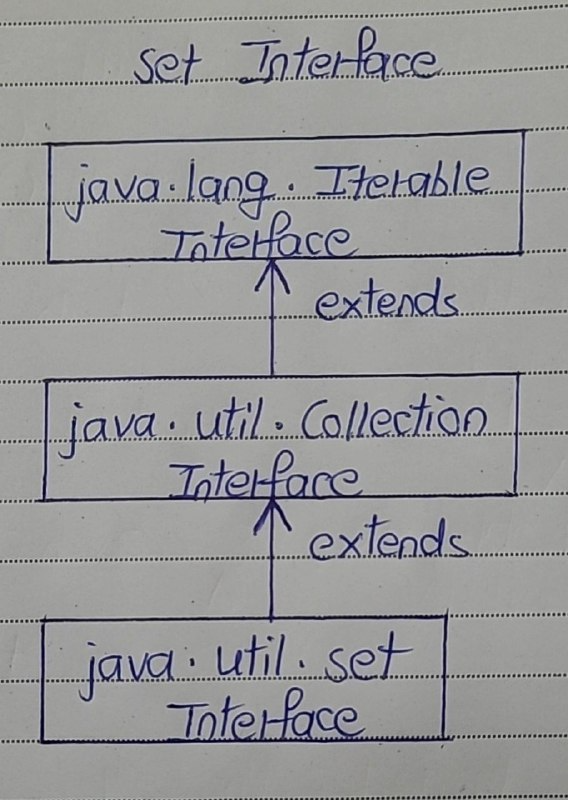

# Set Interface

- The Set interface defines a set. 
- The set is a linear collection of objects with no duplicates. 
- Duplicate elements are not allowed in a set. 
- The Set interface extends Collection interface. 
- Set interface does not have it’s own methods. 
- All it’s methods are inherited from Collection interface. 
- The only change that has been made to Set interface is that add() method will return false if you try to insert an element which is already present in the set.

Below is the hierarchy diagram of Set interface.

## Properties Of Set

1) Duplicate Elements

- Set contains only unique elements. 
- It does not allow duplicates.

2) Null Elements

- Set can contain only one null element.

3) Random Access

- Random access of elements is not possible.

4) Order of Elements

- Order of elements in a set is implementation dependent. 
- HashSet elements are ordered on hash code of elements. 
- TreeSet elements are ordered according to supplied Comparator (If no Comparator is supplied, elements will be placed in ascending order) and LinkedHashSet maintains insertion order.

5) Methods

- Set interface contains only methods inherited from Collection interface. 
- It does not have it’s own methods. 
- But, applies restriction on methods so that duplicate elements are always avoided.

6) Contract

- One more good thing about Set interface is that the stronger contract between equals() and hashCode() methods. 
- According to this contract, you can compare two set instances of different implementation types (HashSet, TreeSet and LinkedHashSet).
- Two set instances, irrespective of their implementation types, are said to be equal if they contain same elements.

## Methods Of Set Interface

| SL No. |      Method                        | Description                                                                 |
|:------:|:----------------------------------:|:---------------------------------------------------------------------------:|
|   1    | int size()                         | Returns the number of elements in the set.                                  |
|   2    | boolean isEmpty()                  | Checks whether the set is empty or not.                                     |
|   3    | boolean contains(Object o)         | Checks whether this set has specified element.                              |
|   4    | Iterator<E> iterator()             | Returns an iterator over the set.                                           |
|   5    | Object[] toArray()                 | It returns an array containing all elements of the set.                     |
|   6    | <T> T[] toArray(T[] a)             | It returns an array of specified type containing all elements of this set.   |
|   7    | boolean add(E e)                   | This method adds specified element to this set if not already present.       |
|   8    | boolean remove(Object o)           | Removes the specified element from this set.                                |
|   9    | boolean containsAll(Collection<?> c) | It checks whether this set contains all elements of passed collection.       |
|  10    | boolean addAll(Collection<? extends E> c) | Adds all elements of the passed collection if not already present.      |
|  11    | boolean removeAll(Collection<?> c) | Removes all elements of this set that are also elements of passed collection.|
|  12    | boolean retainAll(Collection<?> c) | Retains only elements in this set that are also elements of passed collection.|
|  13    | void clear()                       | Removes all elements in this set.                                           |
|  14    | boolean equals(Object o)           | Compares the specified object with this set for equality.                   |
|  15    | int hashCode()                     | Returns the hash code value of this set.                                    |
