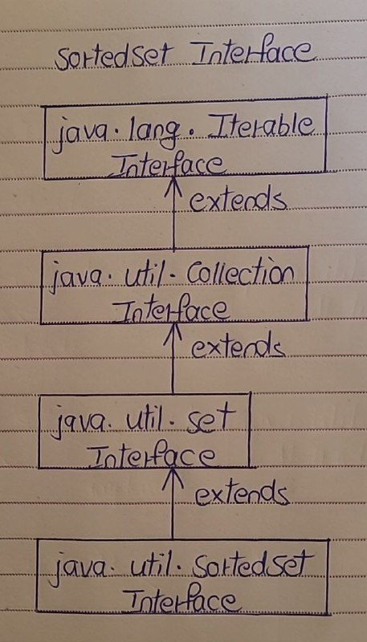

# SortedSet Interface

- The SortedSet interface extends Set interface. 
- SortedSet is a set in which elements are placed according to supplied comparator. 
- This Comparator is supplied while creating a SortedSet. 
- If you don’t supply comparator, elements will be placed in ascending order.

Here is the hierarchy diagram of SortedSet Interface.

## Methods Of SortedSet Interface 

- SortedSet interface defines 6 more methods along with the inherited methods from Set interface. 
- These methods make the processing of SortedSet elements more easy. Here is the list of SortedSet interface methods.

| SL NO. |    SortedSet Interface Methods     | Description                                                                 |
|:------:|:----------------------------------:|:---------------------------------------------------------------------------:|
|   1    | Comparator<? super E> comparator() | Returns Comparator used to order the elements. If no comparator is supplied, it returns null. |
|   2    | SortedSet<E> subSet(E fromElement, E toElement) | Returns a portion of this set whose elements range from ‘fromElement’ (Inclusive) and ‘toElement’ (Exclusive). |
|   3    | SortedSet<E> headSet(E toElement)  | Returns a SortedSet whose elements are in the range from first element of the set (Inclusive) to ‘toElement’ (Exclusive). |
|   4    | SortedSet<E> tailSet(E fromElement) | Returns a SortedSet whose elements are in the range from ‘fromElement’ (Inclusive) to last element of the set (Exclusive). |
|   5    | E first()                          | Returns first element of the SortedSet.                                      |
|   6    | E last()                           | Returns last element of the SortedSet.                                       |

## Properties Of SortedSet Interface

1) Null Elements

- SortedSet can not have null elements. 
- If you try to insert null element, it gives NullPointerException at run time.

2) Duplicate Elements

- As SortedSet is a set, duplicate elements are not allowed.

3) Order of Elements

- SortedSet elements are sorted according to supplied Comparator. 
- If you don’t mention any Comparator while creating a SortedSet, elements will be placed in ascending order.

4) Type of Elements

- Inserted elements must be of Comparable type and they must be mutually Comparable.

5) Random Access

- You can retrieve first element and last elements of the SortedSet. You can’t access SortedSet elements randomly. i.e Random access is denied.

6) Methods

- SortedSets returned by headSet(), tailSet() and subSet() methods are just views of the original set. 
- So, changes in the returned set are reflected in the original set and vice versa.