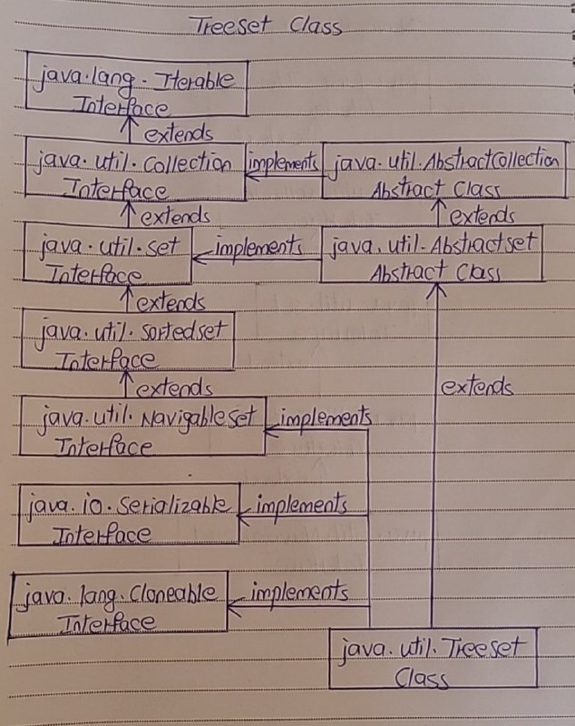

# TreeSet Class

- The TreeSet is another popular implementation of Set interface. 
- Other two implementations of Set interface – HashSet and LinkedHashSet. 
- HashSet doesn’t maintain any order where as LinkedHashSet maintains insertion order. 
- The main difference between these two implementations and Treeset is, elements in TreeSet are sorted according to supplied Comparator. 
- You need to supply this Comparator while creating a TreeSet itself. 
- If you don’t pass any Comparator while creating a TreeSet, elements will be placed in their natural ascending order.

- The TreeSet class in java is a direct implementation of NavigableSet interface which in turn extends SortedSet interface (which in turn extends Set interface). 

Below is the hierarchy diagram of TreeSet class.



## Properties Of TreeSet Class

1) Sorting of Elements

- The elements in TreeSet are sorted according to specified Comparator. 
- If no Comparator is specified, elements will be placed according to their natural ascending order.

```
public class TreeSetExample
{
    public static void main(String[] args)
    {
        //Creating a TreeSet
 
        TreeSet<Integer> set = new TreeSet<Integer>();
 
        //Adding elements to TreeSet
 
        set.add(20);
 
        set.add(10);
 
        set.add(40);
 
        set.add(80);
 
        set.add(30);
 
        //Printing elements of TreeSet
 
        System.out.println(set);      //Output : [10, 20, 30, 40, 80]
 
        //Notice that elements are placed in the sorted order.
    }
}
```

2) Type of Elements

- Elements inserted in the TreeSet must be of Comparable type and elements must be mutually comparable. 
- If the elements are not mutually comparable, you will get ClassCastException at run time.

```
public class TreeSetExample
{
    public static void main(String[] args)
    {
        //Creating a TreeSet
 
        TreeSet<Object> set = new TreeSet<Object>();
 
        //Adding elements to TreeSet
 
        set.add("kkk");      //inserting String type element
 
        set.add(10);        //inserting Integer type element
 
        set.add(new Object());      //inserting Object type element
 
        set.add(20.65);     //inserting Double type element
 
        //The elements inserted are not mutually comparable. So, it will throw ClassCastException.
    }
}
```

3) Null Elements

- TreeSet does not allow even a single null element.

```
public class TreeSetExample
{
    public static void main(String[] args)
    {
        //Creating a TreeSet
 
        TreeSet<String> set = new TreeSet<String>();
 
        //Adding elements to TreeSet
 
        set.add("aaa");      
 
        set.add(null);    //It will throw NullPointerException
 
        set.add("ccc");      
 
        set.add("ddd");
    }
}
```

4) Synchronization

- TreeSet is not synchronized. 
- To get a synchronized TreeSet, use Collections.synchronizedSortedSet() method.

```
public class TreeSetExample
{
    public static void main(String[] args)
    {
        //Creating a TreeSet
 
        TreeSet<String> treeSet = new TreeSet<String>();
 
        //Getting a synchronized TreeSet
 
        Set<String> set = Collections.synchronizedSortedSet(treeSet);
    }
}
```

5) Performance

- TreeSet gives performance of order log(n) for insertion, removal and retrieval operations.

6) Fail-Fast nature

- Iterator returned by TreeSet is of fail-fast nature. 
- That means, If TreeSet is modified after the creation of Iterator object, you will get ConcurrentModificationException.

```
public class TreeSetExample
{
    public static void main(String[] args)
    {
        //Creating a TreeSet
 
        TreeSet<String> set = new TreeSet<String>();
 
        //Adding elements to TreeSet
 
        set.add("aaa");      
 
        set.add("bbb");    
 
        set.add("ccc");      
 
        set.add("ddd");
 
        //Getting Iterator object
 
        Iterator<String> it = set.iterator();
 
        //Modifying the TreeSet after getting Iterator object
 
        set.add("eee");
 
        while (it.hasNext())
        {
            //This statement will throw ConcurrentModificationException
 
            System.out.println(it.next());
        }
    }
}
```

7) Storing Elements

- TreeSet internally uses TreeMap to store it’s elements just like HashSet and LinkedHashSet which use HashMap and LinkedHashMap respectively to store their elements.


## TreeSet Example

- TreeSet is another popular implementation of Set interface along with HashSet and LinkedHashSet. 
- All these implementations of Set interface are required in different scenarios. 
- If you don’t want any order of elements, then you can use HashSet. 
- If you want insertion order of elements to be maintained, then use LinkedHashSet. 
- If you want elements to be ordered according to some Comparator, then use TreeSet. 
- The common thing of these three implementations is that they don’t allow duplicate elements.

1) TreeSet Example With No Comparator

- We already know that if you don’t pass any comparator while creating a TreeSet, elements will be placed in their natural ascending order. 
- In this example, we create a TreeSet of Integers without supplying any Comparator like this,
```
TreeSet<Integer> set = new TreeSet<Integer>();
```

Let’s add some integer elements to it.
```
set.add(23);      
 
set.add(11);    
 
set.add(41);      
 
set.add(7);
 
set.add(69);
 
set.add(18);
 
set.add(38);
```

Print these elements and observe the output.
```
System.out.println(set);      //Output : [7, 11, 18, 23, 38, 41, 69]
```

- We can notice that elements are placed in the ascending order.

- Complete Code

```
public class TreeSetExample
{
    public static void main(String[] args)
    {
        //Creating a TreeSet without supplying any Comparator
 
        TreeSet<Integer> set = new TreeSet<Integer>();
 
        //Adding elements to TreeSet
 
        set.add(23);      
 
        set.add(11);    
 
        set.add(41);      
 
        set.add(7);
 
        set.add(69);
 
        set.add(18);
 
        set.add(38);
 
        //printing elements of TreeSet
 
        System.out.println(set);      //Output : [7, 11, 18, 23, 38, 41, 69]
    }
}
```

2) TreeSet Example With Comparator 

- In this example, we create one TreeSet by supplying a customized Comparator. 
- In this example, we will try to create a TreeSet of Student objects ordered in the descending order of the percentage of marks they have obtained. 
- That means, student with highest marks will be placed at the top.

Let’s create ‘Student’ class with three fields – id, name and perc_Of_Marks_Obtained.
```
class Student
{
    int id;
 
    String name;
 
    int perc_Of_Marks_Obtained;
 
    public Student(int id, String name, int perc_Of_Marks_Obtained)
    {
        this.id = id;
 
        this.name = name;
 
        this.perc_Of_Marks_Obtained = perc_Of_Marks_Obtained;
    }
 
    @Override
    public String toString()
    {
        return id+" : "+name+" : "+perc_Of_Marks_Obtained;
    }
}
```

Let’s define our own Comparator class “MyComparator” which compares the marks of two students.
```
class MyComparator implements Comparator<Student>
{
    @Override
    public int compare(Student s1, Student s2)
    {
        if(s1.id == s2.id)
        {
            return 0;
        }
        else
        {
            return s2.perc_Of_Marks_Obtained - s1.perc_Of_Marks_Obtained;
        }
    }
}
```

Note : TreeSet doesn’t use hashCode() and equals() methods to compare it’s elements. It uses compare() (or compareTo()) method to determine the equality of two elements. 

Create one TreeSet of ‘Student‘ objects with ‘MyComparator‘ as a Comparator.
```
//Instantiating MyComparator
 
MyComparator comparator = new MyComparator();
 
//Creating TreeSet with 'MyComparator' as Comparator.
 
TreeSet<Student> set = new TreeSet<Student>(comparator);
```

Add some elements of type ‘Student‘ to this TreeSet.
```
set.add(new Student(121, "Santosh", 85));
 
set.add(new Student(231, "Cherry", 71));
 
set.add(new Student(417, "David", 82));
 
set.add(new Student(562, "Praveen", 91));
 
set.add(new Student(231, "Raj", 61));         //Duplicate element
 
set.add(new Student(458, "John", 76));
 
set.add(new Student(874, "Peter", 83));
 
set.add(new Student(231, "Hari", 52));       //Duplicate element
 
set.add(new Student(568, "Daniel", 89));
```

Iterate through the TreeSet.
```
//Iterating through TreeSet
 
Iterator<Student> it = set.iterator();
 
while (it.hasNext())
{
    System.out.println(it.next());
}
```

Output will be,
```
562 : Praveen : 91
568 : Daniel : 89
121 : Santosh : 85
874 : Peter : 83
417 : David : 82
458 : John : 76
231 : Cherry : 71
```

- We can notice that student with highest percentage of marks is placed at the top and also duplicate elements are not allowed in the TreeSet.

Complete Code - 

```
// Student Class
 
class Student
{
    int id;
 
    String name;
 
    int perc_Of_Marks_Obtained;
 
    public Student(int id, String name, int perc_Of_Marks_Obtained)
    {
        this.id = id;
 
        this.name = name;
 
        this.perc_Of_Marks_Obtained = perc_Of_Marks_Obtained;
    }
 
    @Override
    public String toString()
    {
        return id+" : "+name+" : "+perc_Of_Marks_Obtained;
    }
}
 
//MyComparator Class
 
class MyComparator implements Comparator<Student>
{
    @Override
    public int compare(Student s1, Student s2)
    {
        if(s1.id == s2.id)
        {
            return 0;
        }
        else
        {
            return s2.perc_Of_Marks_Obtained - s1.perc_Of_Marks_Obtained;
        }
    }
}
 
//MainClass
 
public class MainClass
{
    public static void main(String[] args)
    {
        //Instantiating MyComparator
 
        MyComparator comparator = new MyComparator();
 
        //Creating TreeSet with 'MyComparator' as Comparator.
 
        TreeSet<Student> set = new TreeSet<Student>(comparator);
 
        //Adding elements to TreeSet
 
        set.add(new Student(121, "Santosh", 85));
 
        set.add(new Student(231, "Cherry", 71));
 
        set.add(new Student(417, "David", 82));
 
        set.add(new Student(562, "Praveen", 91));
 
        set.add(new Student(231, "Raj", 61));         //Duplicate element
 
        set.add(new Student(458, "John", 76));
 
        set.add(new Student(874, "Peter", 83));
 
        set.add(new Student(231, "Hari", 52));       //Duplicate element
 
        set.add(new Student(568, "Daniel", 89));
 
        //Iterating though TreeSet
 
        Iterator<Student> it = set.iterator();
 
        while (it.hasNext())
        {
            System.out.println(it.next());
        }
    }
}
```