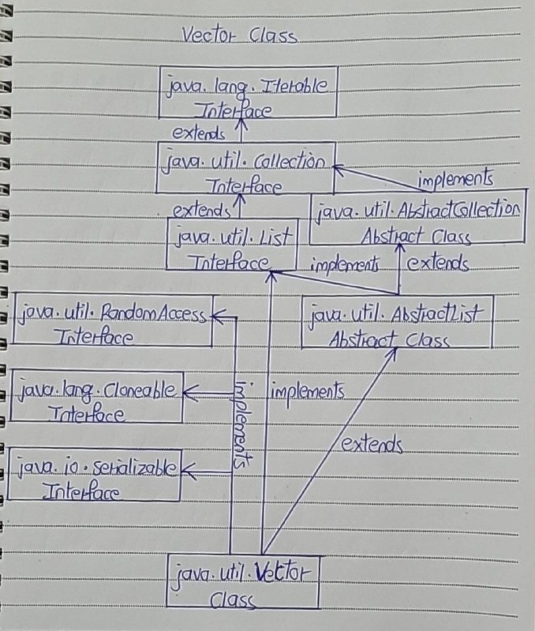

# Vector Class

- The Vector Class is also dynamically grow-able and shrink-able collection of objects like an ArrayList class. 
- But, the main difference between ArrayList and Vector is that Vector class is synchronized. 
- That means, only one thread can enter into vector object at any moment of time.

- Vector class is preferred over ArrayList class when you are developing a multi threaded application. 
- But, precautions need to be taken because vector may reduce the performance of your application as it is thread safe and only one thread is allowed to have object lock at any moment of time and remaining threads have to wait until a thread releases the object lock which is held by it. 
- So, it is always recommended that if you don’t need thread safe environment, it is better to use ArrayList class than the Vector class.

- Vector class has same features as ArrayList. 
- Vector class also extends AbstractList class and implements List interface. 
- It also implements 3 marker interfaces – RandomAccess, Cloneable and Serializable. 

Below is the hierarchy diagram of Vector class.



## Properties Of Vector Class

1) Thread Safety

- The main feature of Vector class is that it is thread safe. 
- All methods of Vector class are synchronized so that only one thread can execute them at any given time. 
- This feature of Vector class is useful when you need thread safe code.
- Thread safe property of Vector class effects the performance of an application as it makes threads to wait for object lock.

2) Capacity Increment

- Capacity Increment : Capacity increment is an amount by which the capacity of the vector is automatically incremented whenever size of the vector exceeds it’s capacity. 
- You can pass this capacity increment while creating a vector. 
- If you don’t pass, capacity increment will be treated as zero and capacity of the vector will be doubled whenever size exceeds capacity.

```
public class MainClass
{
    public static void main(String[] args)
    {
        //Creating vector object with capacity of 3 and with default capacity increment i.e 0
 
        Vector<Integer> vector = new Vector<Integer>(3);
 
        //Printing Current Capacity of Vector
 
        System.out.println(vector.capacity());      //Output : 3
 
        //Adding 4 elements (greater than the capacity) to vector
 
        vector.add(10);
 
        vector.add(20);
 
        vector.add(30);
 
        vector.add(40);
 
        //again Printing Current Capacity of Vector
 
        System.out.println(vector.capacity());     //Output : 6
    }
}
```

3) Size of Vector

- Unlike an ArrayList, you can set the size of the Vector manually. 
- If the new size is greater than the current size, the new slots will be filled with null elements. 
- If the new size is smaller than current size, then the extra elements will be discarded.

```
public class MainClass
{
    public static void main(String[] args)
    {
        //Creating Vector with default initial capacity of 10
 
        Vector<Integer> vector = new Vector<Integer>();
 
        //Adding elements to vector
 
        vector.add(10);
 
        vector.add(20);
 
        vector.add(30);
 
        vector.add(40);
 
        //Retrieving the current size of vector
 
        System.out.println(vector.size());      //Output : 4
 
        //Setting the size of vector as 10.
 
        vector.setSize(10);
 
        //Now retrieving the current size of vector
 
        System.out.println(vector.size());    //Output : 10
 
        //Printing the elements of vector. notice that 6 null elements are inserted
 
        System.out.println(vector);     //Output : [10, 20, 30, 40, null, null, null, null, null, null]
 
        //Again changing the size of vector to 3
 
        vector.setSize(3);
 
        //Printing the elements of vector. notice that extra elements are removed.
 
        System.out.println(vector);    //Output : [10, 20, 30]
    }
}
```

4) Vector using Enumeration object

- You can traverse the vector using Enumeration object. 
- Vector class has a method called elements() which returns an Enumeration object consisting of all elements of Vector.

```
public class MainClass
{
    public static void main(String[] args)
    {
        //Creating Vector with default initial capacity of 10
 
        Vector<Integer> vector = new Vector<Integer>();
 
        //Adding elements to vector
 
        vector.add(10);
 
        vector.add(20);
 
        vector.add(30);
 
        vector.add(40);
 
        //Getting Enumeration object
 
        Enumeration<Integer> en = vector.elements();
 
        //traversing elements of Vector using Enumeration
 
        while (en.hasMoreElements())
        {
            System.out.println(en.nextElement());
        }
 
//      Output :
 
//      10
//      20
//      30
//      40
    }
}
```

5) First and Last Element of Vector Object

- Vector class has separate methods to retrieve first and last element of vector object. 
- You will not find these methods in ArrayList class. firstElement() retrieves first element and lastElement() method retrieves last element of the vector.

```
public class MainClass
{
    public static void main(String[] args)
    {
        //Creating Vector with default initial capacity of 10
 
        Vector<Integer> vector = new Vector<Integer>();
 
        //Adding elements to vector
 
        vector.add(10);
 
        vector.add(20);
 
        vector.add(30);
 
        vector.add(40);
 
        //Getting first element
 
        System.out.println(vector.firstElement());     //Output : 10
 
        //Getting last element
 
        System.out.println(vector.lastElement());      //Output : 40
    }
}
```

