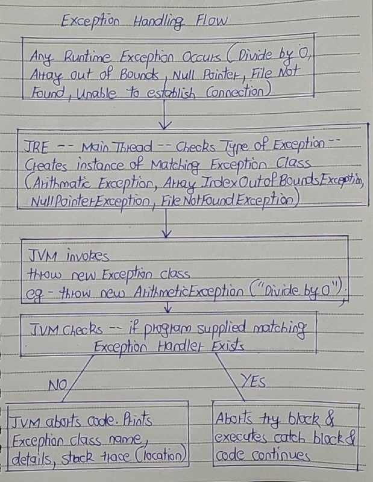

# Exception Handling in Java

- An exception is an abnormal condition which occurs during run time and disrupts the normal flow of the program.  
- This exception must be handled to maintain the normal flow of the program. 
- If this exception is not handled properly, the rest of the program will not be executed. 
- Hence, causing the abrupt termination of the program. 
- Therefore, you must handle the exceptions for the smooth flow of the program. 
- To handle the run time exceptions, one mechanism is provided in java and it is called exception handling.
-  It uses a combination of try, catch, finally, throw, and throws to handle exceptions.
- Exception is also treated as a Object.




## Key Concepts

1) Exception

An exception is an event that occurs during the execution of a program and disrupts its normal flow.

2) Checked and Unchecked Exceptions

- Checked Exceptions: Exceptions that are checked at compile time. They must be either handled using a try-catch block or declared in the method signature using throws. Example: IOException, SQLException.

- Unchecked Exceptions: These are not checked at compile time and occur due to programming errors like logic flaws. Example: NullPointerException, ArrayIndexOutOfBoundsException.

- Java compiler Differentiates between the two i.e Checked and Unchecked Exceptions.
- Java compiler forces the handling of the checked exception upon the programmer(Handling by supplying matching try-catch block or including it in the throws clause.)
- Java compiler does not force the handling of the unchecked exceptions.
- JRE/JVM DOES NOT distinguish between them
- If there is unhandled(i.e. no try-catch block) Checked Exception -- JVM Aborts the code.

## Benefits of Exception Handling

- Maintains normal flow: It prevents abrupt program termination and allows the program to handle errors gracefully.
- Separates error-handling code: The try-catch mechanism helps in keeping the normal logic separate from error-handling code.

## Legal Syntax

1) 
```
try {...} 
catch (ArithmeticException e){...}
```
2) 
```
try {...} 
catch (exc1 e){...} 
catch (exc2 e) {..} ....
```
3) 
```
try {...} 
catch (NPE e){} 
catch (AE e) {}
catch(Exception e){catch-all}
```
4) 
```
try {...} 
catch (AE e){...} 
catch (NPE | AOB | ClassCastException e) {...}
catch(Exception e){catch-all}
```

## Exceptions and their handling using try and catch blocks

1) Number Format Exception

```
public class ExceptionHandling
{
    public static void main(String[] args)
    {
        System.out.println("This statement will be executed"); 
 
        Integer I = new Integer("abc");  //This statement throws NumberFormatException
 
        System.out.println("This statement will not be executed");
    }
}
```

- In the above example, Line 7 throws NumberFormatException. 
- This causes the abrupt termination of the program i.e remaining statement (Line 8) will not be executed. 
- To make it run normally, enclose the statement which is throwing an exception in try-catch blocks. 
- This is shown below,
```
public class ExceptionHandling
{
    public static void main(String[] args)
    {
        System.out.println("This statement will be executed"); 
 
        try
        {
            Integer I = new Integer("abc");  //This statement throws NumberFormatException
        }
        catch (Exception e)
        {
            System.out.println("exception caught");
        }
 
        System.out.println("Now, This statement will also be executed");
    }
}
```

2) Arithmatic Exception

```
public class ExceptionHandling
{
    public static void main(String[] args)
    {
        System.out.println("This statement will be executed"); 
 
        int i = 1000/0;    //This statement throws ArithmaticException : / by zero
 
        System.out.println("This statement will not be executed");
    }
}
```

ArithmaticException can be handled using try-catch blocks.
```
public class ExceptionHandling
{
    public static void main(String[] args)
    {
        System.out.println("This statement will be executed"); 
 
        try
        {
            int i = 1000/0;    //This statement throws ArithmaticException : / by zero
        }
        catch (Exception e)
        {
            System.out.println("Exception Caught");
        }
 
        System.out.println("Now, This statement will also be executed");
    }
}
```

2) Array Index Out Of Bounds Exception

```
public class ExceptionHandling
{
    public static void main(String[] args)
    {
        System.out.println("This statement will be executed"); 
 
        String s = args[1];    //This statement throws ArrayIndexOutOfBoundsException
 
        System.out.println("This statement will not be executed");
    }
}
```

ArrayIndexOutOfBoundsException can be handled using try-catch blocks.
```
public class ExceptionHandling
{
    public static void main(String[] args)
    {
        System.out.println("This statement will be executed"); 
 
        try
        {
            String s = args[1];    //This statement throws ArrayIndexOutOfBoundsException
        }
        catch (Exception e)
        {
            System.out.println("Exception Caught");
        }
 
        System.out.println("Now, This statement will also be executed");
    }
}
```

3) Class Cast Exception

```
public class ExceptionHandling
{
    public static void main(String[] args)
    {
        System.out.println("This statement will be executed"); 
 
        Object o = new Object();
 
        ExceptionHandling e = (ExceptionHandling) o;   //This statement throws ClassCastException
 
        System.out.println("This statement will not be executed");
    }
}
```

ClassCastException using try-catch blocks
```
public class ExceptionHandling
{
    public static void main(String[] args)
    {
        System.out.println("This statement will be executed"); 
 
        Object o = new Object();
 
        try
        {
            ExceptionHandling e = (ExceptionHandling) o;   //This statement throws ClassCastException
        }
        catch (Exception e)
        {
            System.out.println("Exception Caught");
        }
 
        System.out.println("Now, This statement will also be executed");
    }
}
```

4) Null Pointer Exception

```
public class ExceptionHandling
{
    public static void main(String[] args)
    {
        System.out.println("This statement will be executed"); 
 
        String s = null;
 
        System.out.println(s.length());  //This statement throws NullPointerException
 
        System.out.println("This statement will not be executed");
    }
}
```

NullPointerException can be handled using try-catch blocks
```
public class ExceptionHandling
{
    public static void main(String[] args)
    {
        System.out.println("This statement will be executed"); 
 
        String s = null;
 
        try
        {
            System.out.println(s.length());  //This statement throws NullPointerException
        }
        catch (Exception e)
        {
            System.out.println("Exception Caught");
        }
 
        System.out.println("Now, This statement will also be executed");
    }
}
```