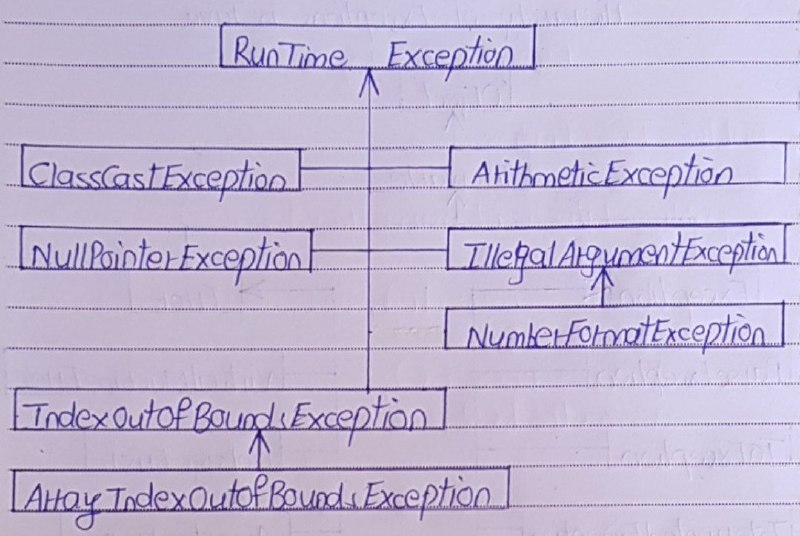
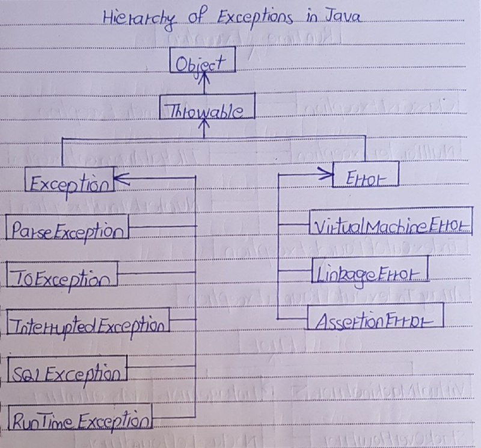

# Exception Handling Question and Answers

1) What is an exception?

- Exception is an abnormal condition which occurs during the execution of a program and disrupts normal flow of a program. 
- This exception must be handled properly. 
- If it is not handled, program will be terminated abruptly.

2) How the exceptions are handled in Java? OR Explain exception handling mechanism in Java?

- Exceptions in Java are handled using try, catch and finally blocks.

- try block : The code or set of statements which are to be monitored for exception are kept in this block.

- catch block : This block catches the exceptions occurred in the try block.

- finally block : This block is always executed whether exception is occurred in the try block or not and occurred exception is caught in the catch block or not.

3) What is the difference between error and exception in Java?

- Errors are mainly caused by the environment in which an application is running. 
- For example, OutOfMemoryError happens when JVM runs out of memory. 
- Where as exceptions are mainly caused by the application itself. 
- For example, NullPointerException occurs when an application tries to access null object.

4) Can we keep other statements in between try, catch and finally blocks?

- No. We shouldn’t write any other statements in between try, catch and finally blocks.
```
try
{
    // Statements to be monitored for exceptions
}
 
//You can't keep statements here
 
catch(Exception ex)
{
    //Catching the exceptions here
}
 
//You can't keep statements here
 
finally
{
    // This block is always executed
}
```

5) Can we write only try block without catch and finally blocks?

- No, it shows compilation error. The try block must be followed by either catch block or finally block.

- Note : From Java 7, with the introduction of try-with resources blocks, we can write only try block without catch and finally blocks provided resources must be AutoCloseable.

6) There are three statements in a try block – statement1, statement2 and statement3. After that there is a catch block to catch the exceptions occurred in the try block. Assume that exception has occurred in statement2. Does statement3 get executed or not?

- No, statement3 is not executed. 
- Once a try block throws an exception, remaining statements will not be executed. 
- Control comes directly to catch block.

7) What is unreachable catch block error?

- When you are keeping multiple catch blocks, the order of catch blocks must be from most specific to general ones. i.e sub classes of Exception must come first and super classes later. 
- If you keep super classes first and sub classes later, compiler will show unreachable catch block error.
```
public class ExceptionHandling
{
    public static void main(String[] args)
    {
        try
        {
            int i = Integer.parseInt("abc");   //This statement throws NumberFormatException
        }
 
        catch(Exception ex)
        {
            System.out.println("This block handles all exception types");
        }
 
        catch(NumberFormatException ex)
        {
            //Compile time error
            //This block becomes unreachable as
            //exception is already caught by above catch block
        }
    }
}
```

8) Explain the hierarchy of exceptions in Java?

 




9) What are run time exceptions in Java. Give example?

- The exceptions which occur at run time are called as run time exceptions. 
- These exceptions are unknown to compiler. 
- All sub classes of java.lang.RunTimeException and java.lang.Error are run time exceptions. 
- These exceptions are unchecked type of exceptions. 
- For example, NumberFormatException, NullPointerException, ClassCastException, ArrayIndexOutOfBoundException, StackOverflowError etc.

10) What is OutOfMemoryError in Java?

- OutOfMemoryError is the sub class of java.lang.Error which occurs when JVM runs out of memory.

11) What are checked and unchecked exceptions in java?

- Checked exceptions are the exceptions which are known to compiler. 
- These exceptions are checked at compile time only. 
- Hence the name checked exceptions. 
- These exceptions are also called compile time exceptions. 
- Because, these exceptions will be known during compile time itself.

- Unchecked exceptions are those exceptions which are not at all known to compiler. 
- These exceptions occur only at run time. 
- These exceptions are also called as run time exceptions. 
- All sub classes of java.lang.RunTimeException and java.lang.Error are unchecked exceptions.

12) What is the difference between ClassNotFoundException and NoClassDefFoundError in Java?

| ClassNotFoundException | NoClassDefFoundError |
|:--------------:|:--------------:|
| It is an exception. It is of type java.lang.Exception. | It is an error. It is of type java.lang.Error. |
| It occurs when an application tries to load a class at run time which is not updated in the classpath. | It occurs when Java runtime system doesn’t find a class definition, which is present at compile time, but missing at run time. |
| It is thrown by the application itself. It is thrown by the methods like Class.forName(), loadClass() and findSystemClass(). | It is thrown by the Java Runtime System. | 
| It occurs when classpath is not updated with required JAR files. | It occurs when required class definition is missing at run time. | 

13) Can we keep the statements after finally block If the finally block is returning the control?

- No, it gives unreachable code error. 
- Because, control is returning from the finally block itself. 
- Compiler will not see the statements after it. 
- That’s why it shows unreachable code error.

14) Does finally block get executed If either try or catch blocks are returning the control?

- Yes, finally block will be always executed no matter whether try or catch blocks are returning the control or not.

15) Can we throw an exception manually? If yes, how?

Yes, we can throw an exception manually using throw keyword. Syntax for throwing an exception manually is
```
throw InstanceOfThrowableType;
```
Below example shows how to use throw keyword to throw an exception manually.

```
try
{
    NumberFormatException ex = new NumberFormatException();    //Creating an object to NumberFormatException explicitly
 
    throw ex;        //throwing NumberFormatException object explicitly using throw keyword
}
catch(NumberFormatException ex)
{
    System.out.println("explicitly thrown NumberFormatException object will be caught here");
}
```

16) What is Re-throwing an exception in Java?

- Exceptions raised in the try block are handled in the catch block. 
- If it is unable to handle that exception, it can re-throw that exception using throw keyword. 
- It is called re-throwing an exception.
```
try
{
    String s = null;
    System.out.println(s.length());   //This statement throws NullPointerException
}
catch(NullPointerException ex)
{
    System.out.println("NullPointerException is caught here");
 
    throw ex;     //Re-throwing NullPointerException
}
```

17) What is the use of throws keyword in Java?

- throws keyword is used to specify the exceptions that a particular method can throw. 
- The syntax for using throws keyword is,
```
return_type method_name(parameter_list) throws exception_list
{
     //some statements
}
```

18) Why it is always recommended that clean up operations like closing the DB resources to keep inside a finally block?

- Because finally block is always executed whether exceptions are raised in the try block or not and raised exceptions are caught in the catch block or not. 
- By keeping the clean up operations in finally block, you will ensure that those operations will be always executed irrespective of whether exception is occurred or not.

19) What is the difference between final, finally and finalize in Java?

| final | finally | finalize() |
|:--------------:|:--------------:|:--------------:|
| final is a keyword in Java which is used to make a variable or a method or a class as unchangeable. | finally is a block in Java which is used for exception handling along with try and catch blocks. | finalize() method is a protected method of java.lang.Object class which is used to perform some clean up operations on an object before it is removed from the memory. |
| The value of a variable which is declared as final can’t be changed once it is initialized. | finally block is always executed whether an exception is occurred or not and occurred exception is handled or not. | This method is called by garbage collector thread before an object is removed from the memory. |
| A method declared as final can’t be overridden or modified in the sub class and a class declared as final can’t be extended. | Most of time, this block is used to close the resources like database connection, I/O resources etc soon after their use. | This method is inherited to every class you create in Java. |

20) What is ClassCastException in Java?

- ClassCastException is a RunTimeException which occurs when JVM is unable to cast an object of one type to another type.

21) What is the difference between throw, throws and throwable in Java?

| throw | throws | Throwable |
|:--------------:|:--------------:|:--------------:|
| throw is a keyword in Java which is used to throw an exception manually. | throws is also a keyword in java which is used in the method signature to indicate that this method may throw mentioned exceptions. | Throwable is a super class for all types of errors and exceptions in Java. This class is a member of java.lang package. |
| Using throw keyword, you can throw an exception from any method or block. But, that exception must be of type java.lang.Throwable class or it’s sub classes. | The caller to such methods must handle the mentioned exceptions either using try-catch blocks or using throws keyword. | Only instances of this class or it’s sub classes are thrown by the java virtual machine or by the throw statement. |

22) What is StackOverflowError in Java?

- StackOverflowError is an error which is thrown by the JVM when stack overflows.

23) Can we override a super class method which is throwing an unchecked exception with checked exception in the sub class?

- No. If a super class method is throwing an unchecked exception, then it can be overridden in the sub class with same exception or with any other unchecked exceptions but can not be overridden with checked exceptions.

24) Which class is the super class for all types of errors and exceptions in Java?

- java.lang.Throwable is the super class for all types of errors and exceptions in Java.

25) What are the legal combinations of try, catch and finally blocks?

1. 
```
try
{
    //try block
}
catch(Exception ex)
{
    //catch block
}
```

2. 
```
try
{
    //try block
}
finally
{
    //finally block
}
```

3. 
```
try
{
    //try block
}
catch(Exception ex)
{
    //catch block
}
finally
{
    //finally block
}
```

26) What is the use of printStackTrace() method?

- printStackTrace() method is used to print the detailed information about the exception occurred.

27) Give some examples to checked exceptions?

- ClassNotFoundException, SQLException, IOException

28) Give some examples to unchecked exceptions?

- NullPointerException, ArrayIndexOutOfBoundsException, NumberFormatException

29) Do you know try-with-resources blocks? Why do we use them? When they are introduced?

- Try-with-resources blocks are introduced from Java 7 to auto-close the resources like File I/O streams, Database connection, network connection etc… used in the try block. 
- You need not to close the resources explicitly in your code. 
- Try-with-resources implicitly closes all the resources used in the try block.

30) What are the benefits of try-with-resources?

- The main benefit of try-with-resources is that it avoids resource leaks that could happen if we don’t close the resources properly after they are used. 
- Another benefit of try-with-resources is that it removes redundant statements in the code and thus improves the readability of the code.

31) What are the changes made to exception handling from Java 7?

Multi-catch exceptions and try-with-resources are two major changes made to exception handling from Java 7.

32) What are the differences between StackOverflowError and OutOfMemoryError In Java?

| StackOverflowError | OutOfMemoryError | 
|:--------------:|:--------------:|
| It is related to Stack memory. | It is related to heap memory. | 
| It occurs when Stack is full. | It occurs when heap is full. | 
| It is thrown when you call a method and there is no space left in the stack. | It is thrown when you create a new object and there is no space left in the heap. | 
| It occurs when you are calling a method recursively without proper terminating condition. | It occurs when you are creating lots of objects in the heap memory. | 
| How to avoid?
Make sure that methods are finishing their execution and leaving the stack memory. | How to avoid?
Try to remove references to objects which you don’t need anymore. | 

