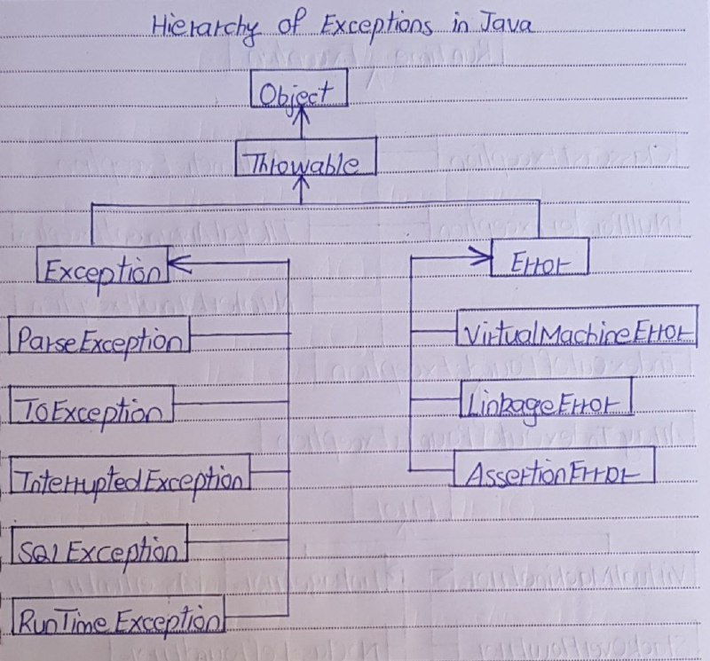
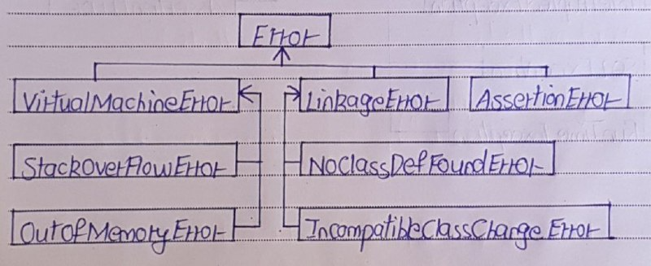
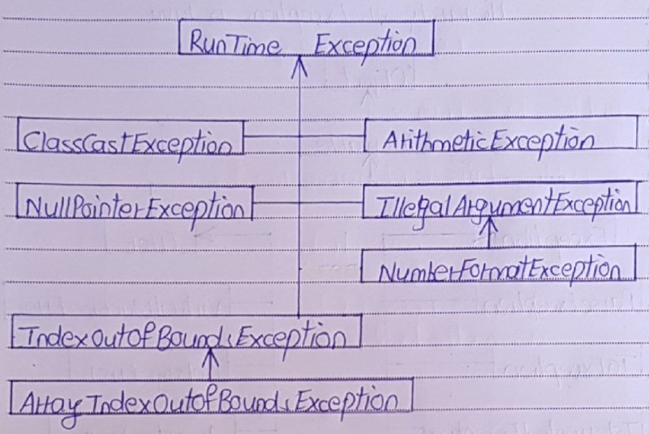

# Hierarchy of Exceptions in Java

- The hierarchy of exceptions in Java is organized into two main categories: Checked Exceptions and Unchecked Exceptions. 
- All exceptions are subclasses of the java.lang.Throwable class.

## Checked Exceptions

- Checked exceptions are known to compiler i.e they are the exceptions that are checked at compile time. 
- Checked exceptions are also called compile time exceptions, because they can be known during compile time.

## Unchecked Exceptions

- Unchecked exceptions are not known to compiler.  
- They are the exceptions that are not checked at compile time, because they occur only at run time.
- That’s why these exceptions are also called run time exceptions.

## java.lang.Throwable

- java.lang.Throwable is the super class of all errors and exceptions in java. 
- Throwable class extends java.lang.Object class. 
- The only argument of catch block must be it’s type or it’s sub class type.

1) java.lang.Error

2) java.lang.Exception

## java.lang.Error

- java.lang.Error is the super class for all types of errors in java.
- All sub classes of Error class are unchecked type of exceptions. i.e They occur during run time only.

Some of the common errors are,

1) java.lang.VirtualMachineError : The most common virtualMachineErrors are StackOverFlowError and OutOfMemoryError.
2) java.lang.AssertionError
3) java.lang.LinkageError  : The common LinkageError are NoClassDefFoundError and subclasses of IncompatibleClassChangeError. The most frequent IncompatibleClassChangeErrors are NoSuchMethodError, NoSuchFieldError, AbstractMethodError, IllegalAccessError and InstantiationError.

## java.lang.Exception 

- java.lang.Exception is the super class for all types of Exceptions in java. 
- All sub classes of Exception class except sub classes of RunTimeException are checked type of exceptions. 

Some of the common sub classes of Exception are,

1) java.lang.InterruptedException
2) java.lang.IOException
3) java.lang.SQLException
4) java.lang.ParseException
5) java.lang.RunTimeException

- All sub classes of RunTimeException are unchecked type of exceptions. i.e They occur during run time only. 
- Some common RunTimeException are ArithmeticException, NumberFormatException, NullPointerException, ArrayIndexOutOfBoundsException and ClassCastException.

## Hierarchy

- java.lang.Error

- RunTime Exception
