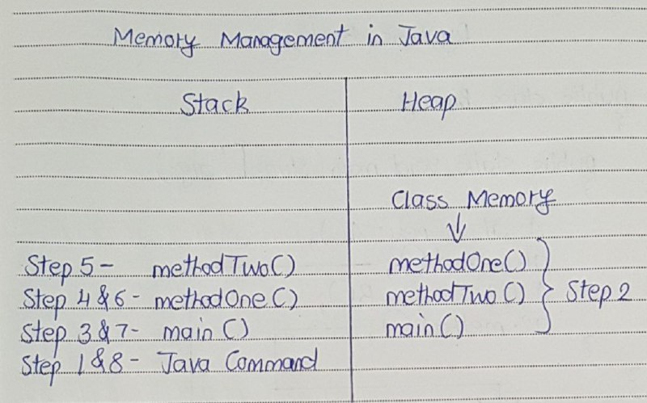

# Memory Management in Java

- Whenever you trigger a java command, it divides allocated memory into two parts – Stack and Heap. 
- Stack is used only for execution purpose. 
- Heap is used for  storage purpose.

Consider the following program 
```
class StackAndHeapMemory
{
     static void methodOne()
     {
          System.out.println("From Method One");
          methodTwo();
     }
 
     static void methodTwo()
     {
          System.out.println("From Method Two");
     }
 
     public static void main(String[] args)
     {
          System.out.println("Main Method Started");
          methodOne();
          System.out.println("Main Method Ended");
     }
}
```

Output :
```
Main Method Started
From Method One
From Method Two
Main Method Ended
```
When you trigger >java StackAndHeapMemory, java command divides allocated memory into two parts.

1) Step 1 :

- First java command enters the stack memory for execution. 
- First it checks whether the class StackAndHeapMemory is loaded in heap memory or not. 
- If it is not loaded, loading operation of class StackAndHeapMemory starts.

2) Step 2 :

- Randomly one object is created in the heap memory. 
- It is also called Class Memory.  
- After object creation, all static members are loaded into class memory. 
- You know that execution of every java program start with main() method. 
- So, java commands calls main() method for execution.

3) Step 3 :

- main() method enters stack memory for execution. 
- First statement in main() method (Line 16) is executed. 
- It prints “Main Method Started” on the console. 
- In the second statement (Line 17), it calls methodOne() for execution.

4) Step 4 :

- methodOne() enters the stack for execution. 
- First statement (Line 5) of methodOne() is executed first. 
- It prints “From Method One” on the console. 
- In the second statement (Line 6), it calls methodTwo() for execution.

5) Step 5 :

- methodTwo() enters the stack for execution. 
- In the methodTwo(), there is only one statement (Line 11). 
- This statement is executed. 
- It prints “From Method Two” on the console. 
- There is no other statements in methodTwo(). 
- So, methodTwo() leaves stack memory.

6) Step 6 :

- Now, again control comes back to methodOne(). 
- Second statement (Line 6) of methodOne() is already executed in step 4. 
- There are no other statements left in methodOne(). 
- So, methodOne() also leaves stack.

7) Step 7 :

- Now, control comes back to main() method. 
- second statement (Line 17) of main() is already executed is in step 3. 
- So, now third statement (Line 18) is executed. 
- It prints “Main Method Ended” on the console. 
- As there are no other statements left in main() method, it also leaves stack after clearing the heap memory.

8) Step 8 :

- java command also leaves stack memory and gives back the allocated memory to OS.

Here is the diagrammatic representation of memory allocation of the above program.

