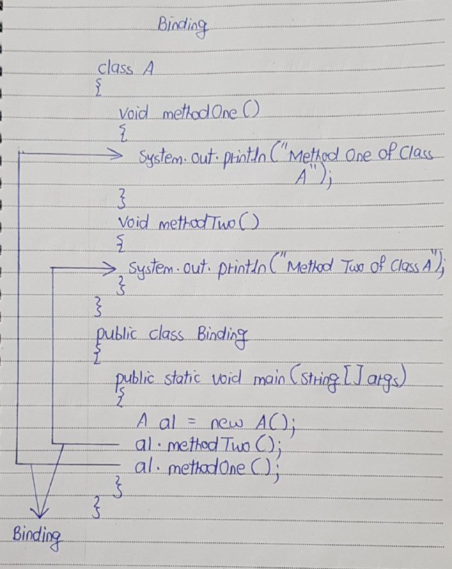
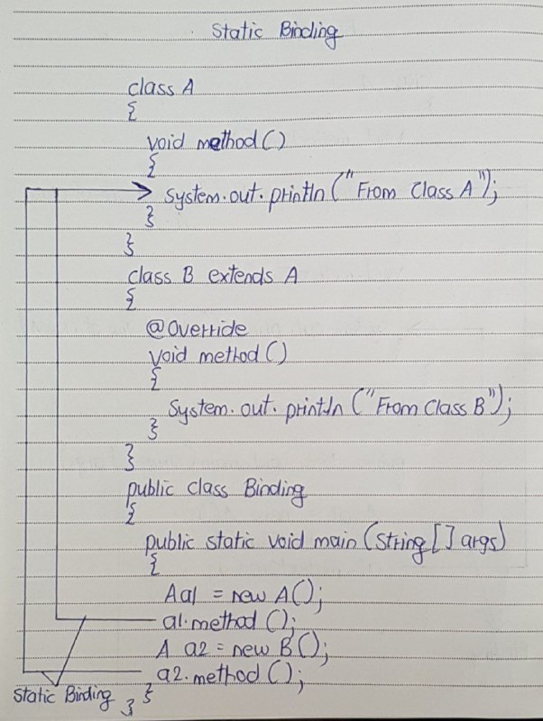
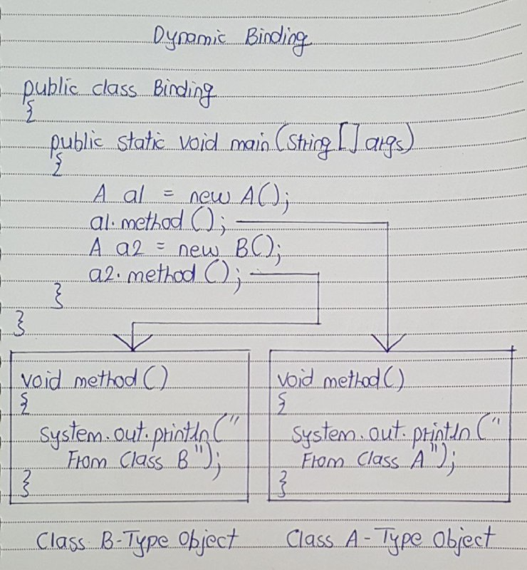

# Binding in Java

- Binding in Java refers to the process of connecting a method call to the actual code that will run. 



- In this picture, “a1.methodOne()” call is binding to corresponding methodOne() definition and “a1.methodTwo()” call is binding to corresponding methodTwo() definition.

- For every method call there should be proper method definition. 
- This is a rule in java. If compiler does not see the proper method definition for every method call, it throws error.

## Types of Binding

1) Static Binding (happens during compilation) 
2) Dynamic Binding (happens during runtime).

## Static Binding (Early Binding)

- Static binding is a binding which happens during compilation. 
- It is also called early binding because binding happens before a program actually runs.
- Static Binding happens when the method to be called is decided during compile time i.e. when the code is being prepared by the compiler.

When does static binding happen?
- When methods are private, final, or static.
- When methods are overloaded (same method name but different parameters).

Simple way to remember:
- The compiler knows in advance which method to call.
```
class Animal {
    // Private method, so it cannot be overridden
    private void sound() {
        System.out.println("Animal makes a sound");
    }
    
    // Static method
    public static void staticSound() {
        System.out.println("Animal static sound");
    }
}

class Dog extends Animal {
    // This method is not overriding, it's a new method
    public void sound() {
        System.out.println("Dog barks");
    }
    
    // This method hides the static method from the superclass
    public static void staticSound() {
        System.out.println("Dog static sound");
    }
}

public class Main {
    public static void main(String[] args) {
        Animal animal = new Dog();
        
        // This will call the Animal class's sound() because it's private (static binding)
        animal.staticSound(); // Output: Animal static sound

        // This will call the Dog class's sound() as static binding is only for private/static/final methods.
        Dog.staticSound(); // Output: Dog static sound
    }
}
```

- Here, the sound() method in Animal is private, so it cannot be overridden. 
- Even if you create an object of the Dog class, it will use the Animal class's method because of static binding. 
- The same applies to static methods.



- In this picture, ‘a1’ is a reference variable of type Class A pointing to object of class A.  
- ‘a2’ is also reference variable of type class A but pointing to object of Class B.

- During compilation, while binding, compiler does not check the type of object to which a particular reference variable is pointing. 
- It just checks the type of reference variable through which a method is called and checks whether there exist a method definition for it in that type.

- For example, for “a1.method()” method call in the above picture, compiler checks whether there exist method definition for method() in Class A. 
- Because ‘a1′ is Class A type. 
- Similarly, for “a2.method()” method call, it checks whether there exist method definition for method() in Class A. 
- Because ‘a2′ is also Class A type. 
- It does not check to which object, ‘a1’ and ‘a2’ are pointing. This type of binding is called static binding.

## Dynamic Binding (Late Binding)

- Dynamic Binding happens when the method to be called is decided during runtime i.e. when the program is running. 
- It is also called late binding because binding happens when program actually is running.
- This usually occurs when you are dealing with method overriding.

When does dynamic binding happen?
- When methods are overridden in a subclass (same method name and parameters, but the method in the subclass changes the behavior).

Simple way to remember:
- The method to be called depends on the actual object type at runtime, even if the reference is of a parent type.

```
class Animal {
    // This method will be overridden in subclass
    public void sound() {
        System.out.println("Animal makes a sound");
    }
}

class Dog extends Animal {
    // Overriding the sound method
    @Override
    public void sound() {
        System.out.println("Dog barks");
    }
}

public class Main {
    public static void main(String[] args) {
        Animal animal = new Dog(); // Animal reference, Dog object
        animal.sound();            // Output: Dog barks
    }
}
```

In this example, the actual method that gets called is determined at run time based on the object type (Dog), even though the reference is of type Animal. This is an example of dynamic binding.



- During run time actual objects are used for binding. 
- For example, for “a1.method()” call in the above picture, method() of actual object to which ‘a1’ is pointing will be called. 
- For “a2.method()” call, method() of actual object to which ‘a2’ is pointing will be called. 
- This type of binding is called dynamic binding.

## Differences Between Static and Dynamic Binding

| Feature | Static Binding | Dynamic Binding |
|:--------------:|:--------------:|:--------------:|
| Binding Time | Compile Time, It is a binding that happens at compile time. | Run Time, It is a binding that happens at run time. |
| Associated With | Method Overloading, Static, Final, Private methods | Method Overriding |
| Method Invocation | Determined by reference type, Actual object is not used for binding. | Determined by object type, Actual object is used for binding. |
| Performance | Faster, It is also called early binding because binding happens during compilation. | Slower (due to runtime lookup), 	It is also called late binding because binding happens at run time. |
| Flexibility | Less flexible (fixed at compile time) | More flexible (determined at run time) |


## When to Use Static and Dynamic Binding

- Static binding is used when you know at compile time which method should be invoked. It's typically seen in cases of overloaded methods, static methods, and methods that cannot be overridden (like private and final methods).

- Dynamic binding is more commonly used in object-oriented programming with polymorphism, allowing you to write code that is flexible and extensible. With dynamic binding, method calls are resolved at runtime, depending on the actual object type, which allows for method overriding and more flexible code behavior.