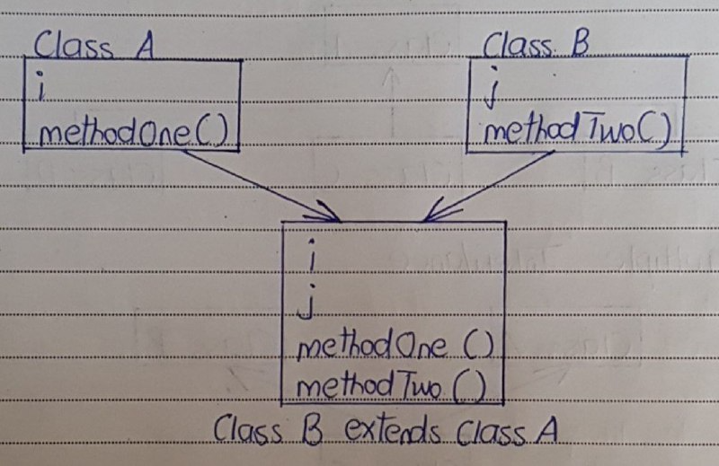
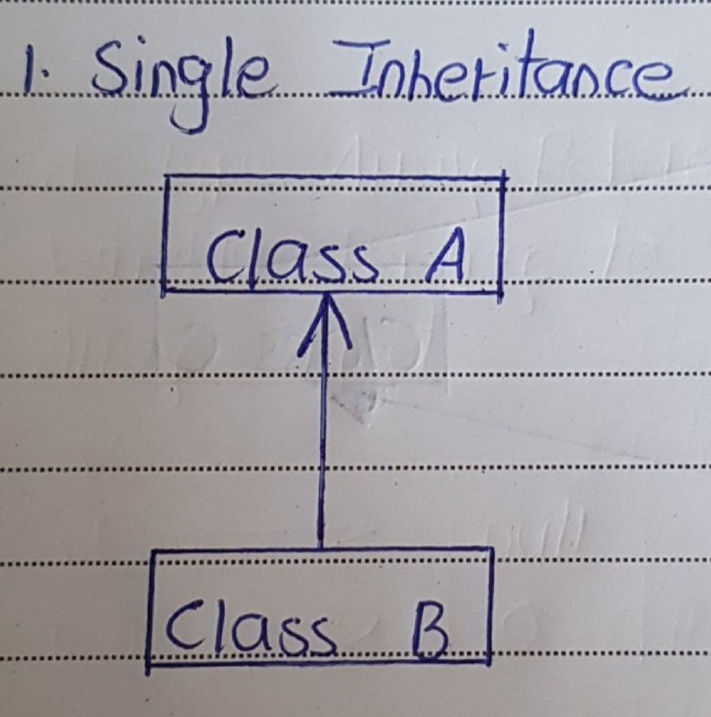
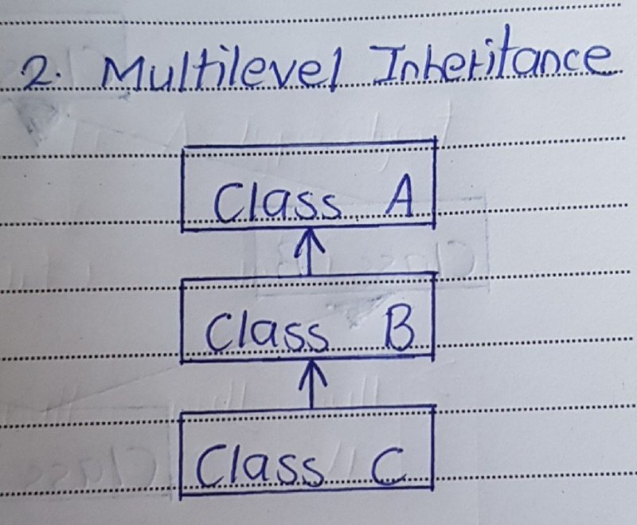
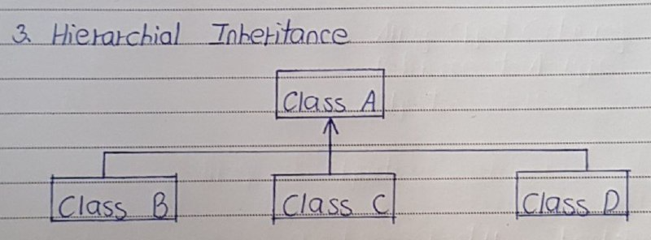
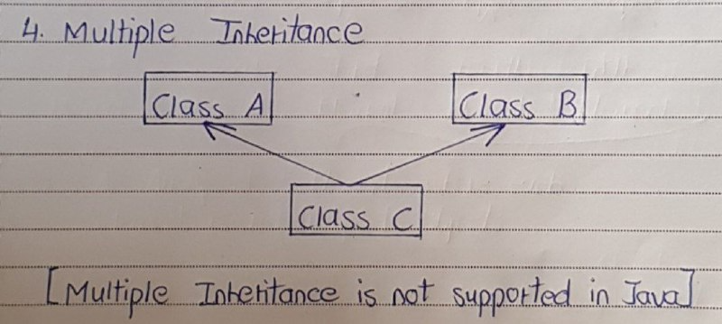
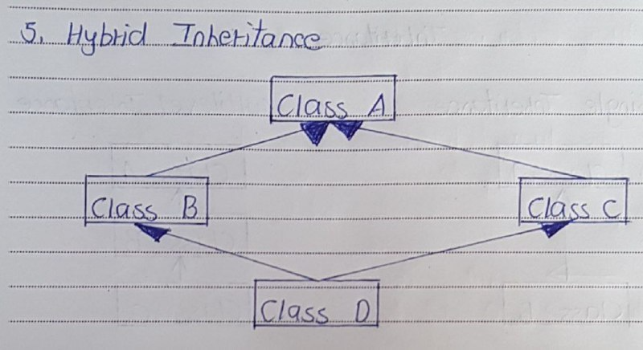

# Inheritance In Java

- Inheritance in java is used to add additional functionalities to the existing class. 
- Inheritance is used to extend the present class by adding some more properties to it. 
- Inheritance is used to reuse the present tried and tested code so that you may not have to write them and compile them again.

Inheritance in java is implemented by using extend keyword like below,
```
class A
{
    int i;
    void methodOne()
    {
        System.out.println("From methodOne");
    }
}
 
class B extends A
{
    int j;
    void methodTwo()
    {
        System.out.println("From methodTwo");
    }
}
```

- Here, Class A has two members – ‘i’ and ‘methodOne()’. 
- Class B also has two members – ‘j’ and ‘methodTwo()’. 
- Class B is extending Class A. 
- Therefore, members of class A are inherited to Class B. 
- Now, Class B will have two additional members inherited from class A along with its members. Have a look at the below diagram,



- Here, Class A is called super class and Class B is called sub class. 
- Here, you can analyse the inheritance like this – we are extending class A by adding additional properties to it through Class B or We are reusing properties of Class A in Class B.


## Important Points of Inheritance

1) Constructors, Static Initialization Block and Instance Initialization Block

- Constructors, SIB – Static Initialization Block and IIB – Instance Initialization Block of super class will not be inheriting to its sub class. 
- But they are executed while creating an object to sub class. For example,
```
class A
{
    int i;
 
    static
    {
        System.out.println("Class A SIB");
    }
 
    {
        System.out.println("Class A IIB");
    }
 
    A()
    {
        System.out.println("Class A Constructor");
    }
}
 
class B extends A
{
    int j;
}
 
class MainClass
{
    public static void main(String[] args)
    {
        B b = new B();
    }
}
```

- In the above example, Class B is extending Class A. 
- In the MainClass, We are creating an object to Class B. 
- While creating this object, SIB, IIB and constructor of Class A are also executed. 
The output of the above program will be,
```
Class A SIB
Class A IIB
Class A Constructor
```

- Static members of super class are inheriting to sub class as static members and non-static members are inheriting as non-static members only.


2) Constructor in Inheritance

```
class A
{
    int i;
 
    A(int i)
    {
        System.out.println("Class A Constructor");
    }
}
 
class B extends A
{
    int j;
}
```

- You will get a compile time error saying implicit default constructor A() is undefined for Class A. 
- Compiler will force you to write constructor in Class B. 
- Because, we are not defining constructor for Class B. 
- So, compiler will be providing default constructor. 
- In that default constructor, first statement is super() – it is a calling statement to default constructor of Class A. 
- But it is not defined in Class A. 
- Therefore you will get a compile time error. 
- To avoid this error, write the constructor for sub class. 
- From that constructor call super class constructor explicitly. 
```
class A
{
    int i;
 
    A(int i)
    {
        System.out.println("Class A Constructor");
    }
}
 
class B extends A
{
    int j;
 
    public B()
    {
        super(10);     //Explicitly Calling Class A constructor
        System.out.println("Class B Constructor");
    }
}
```

3) Inherited from Object Class

- By default, every class is a sub class of java.lang.Object class. 
- So, every class in java has properties inherited from Object class. Look at the below code,
```
class A
{
     //some satements
}
```

Compiler will treat the above code as,
```
class A extends Object
{
     //some satements
}
```

4) Extending One Class from itself

Any class can not extend itself i.e
```
class A extends A
{
     //It gives compile time error
}
```

5) super() and this()

We can call super class constructor explicitly through super() calling statement from sub class constructor and we can call other constructors of the same class through this() calling statement but, we can’t call sub class constructor from super class constructor.
```
class A
{
     A()
     {
          //B();      There is no statement in java to call subclass constructor
          System.out.println("Class A Constructor");
     }
}
 
class B extends A
{
     B()
     {
          super();        // calling statement to super class constructor
          System.out.println("Class B Constructor");
     }
}
```


## Access Modifiers for Inheritance

1) private : Private members can not be inherited to sub class.

2) Default : Default members can be inherited to sub class within package.

3) protected : protected members can be inherited to any sub class but usage of protected member is limited within package.

4) public : public members are inherited to all sub classes.

```
package com1;
 
public class A
{
    private int i;
    int j;
    protected int k;
    public int m;
}
 
class B extends A
{
    void methodOfClassB()
    {
        //System.out.println(i);        Private member can not be inherited
        System.out.println(j);           //Default member can be inherited within package
        System.out.println(k);         //protected member can be inherited to any subclass
        System.out.println(m);       //public member can be inherited to all sub classes
    }
}
 
class C extends B
{
    void methodOfClassC()
    {
        System.out.println(j);     //Default member can be inherited within package
        System.out.println(k);    //protected member can be inherited to any subclass
        System.out.println(m);    //public member can be inherited to any subclass
 
        B b = new B();
        System.out.println(b.j);   //Default member can be used within package
        System.out.println(b.k);   //Protected member can be used anywhere in the package
        System.out.println(b.m);  //Public member can be used anywhere
    }
}
 
package com2;
import com1.A;
 
public class D extends A
{
    void methodOfClassD()
    {
        //System.out.println(j);   Default members can not be inherited outside package
        System.out.println(k);  //Protected member can be inherited to any subclass
        System.out.println(m);  //public member is always inherited to any subclass
 
        A a = new A();
        //System.out.println(a.i);   private member not visible outside the class
        //System.out.println(a.j);   Default members are not visible outside package
        //System.out.println(a.k);   Protected member can not be used outside the package.
        System.out.println(a.m);     //public member can be used anywhere
    }
}
 
class E extends D
{
    void methodOfClassE()
    {
        System.out.println(k);     //Protected member can be inherited to any subclass
        System.out.println(m);     //public member is always inherited
 
        D d = new D();
        //System.out.println(d.k);     Protected member can not be used outside the package.
        System.out.println(d.m);    //public member can be used anywhere
    }
}
```


## Types of Inheritance

1) Single Inheritance



One class is extended by only one class.

2) Multilevel Inheritance



One class is extended by a class and that class is extended by another class thus forming chain of inheritance.

3) Hierarchical Inheritance



One class is extended by many class.

4) Multiple Inheritance



One class extends more than one class.

- Multiple inheritance is not used in Java to avoid ambiguity and complexity, often referred to as the "Diamond Problem." 
- This problem arises when a class inherits from two classes that both have a method with the same signature. 
- Java prevents multiple inheritance of classes to eliminate the confusion about which method the subclass should inherit.
- Instead, Java uses interfaces to achieve similar functionality. 
- A class can implement multiple interfaces, allowing a form of multiple inheritance without the complexity. 
- This approach ensures that there is no ambiguity because interfaces do not provide method implementations, just method signatures.

Using Multiple Inheritance in Java
```
class A
{
    void methodOne()
    {
        System.out.println("From methodOfClassA");
    }
}
 
class B
{
    void methodOne()
    {
        System.out.println("From methodOfClassB");
    }
}
 
class C extends A, B (If it is supported)
{
    //Both the methods with same name are inherited to Class B
    //This causes ambiguity and confusion. Therefore,
    //Multiple Inheritance is not supported in java
}
```

- In the above example, Class A also has methodOne() and Class B also has methodOne(). 
- Class C is extending both the classes. 
- So both the methods with same name are inheriting to Class C. 
- It causes confusion and ambiguity for which method to use. 
- Therefore, To avoid this, multiple inheritance is not supported in java.

Using Interface
```
interface A {
    void methodA();
}

interface B {
    void methodB();
}

class C implements A, B {
    public void methodA() {
        System.out.println("Method A");
    }

    public void methodB() {
        System.out.println("Method B");
    }
}
```

In this case, class C implements both A and B interfaces, effectively simulating multiple inheritance.


5) Hybrid Inheritance



It is a combination of above types of inheritance.