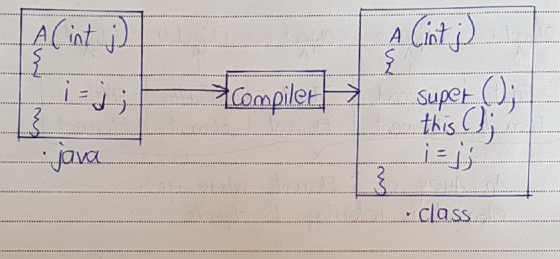

# Instance Initialization Block

- Instance Initialization Block (IIB), this block is used to initialize state of an object. 
- State of an object is indicated by instance variables or non-static variables. 
- So, IIB is used to initialize instance variables or non-static variables.

This is a block with no name and enclosed within {}. The syntax for IIB is,
```
{
      //Set Of Statements, mostly initialization statements
}
```

Consider this example,
```
class A
{
     int i;
 
     {
         i = 10;
     }
 
     A(int j)
     {
         i = j;
     }
}
 
class MainClass
{
     public static void main(String[] args)
     {
          A a = new A(50);
          System.out.println(a.i);
     }
}
```

- In the above example, Class A has one instance variable (int i), one IIB block (From Line 5 to Line 7) and one constructor.
- We know that first statement of constructor is super() or this(). 
- After executing first statement, IIB blocks are called. 
- After executing IIB blocks, remaining statements are executed.

So, when the constructor is called while creating an object (Line 19), compiler will treat constructor code like this,


where this() is a calling statement to IIB block.

- You can keep any number of IIB blocks in a class. 
- All blocks are called after super() in the constructor in the order they appear.

Important Note : IIB blocks will not be called from the constructor in which this() statement is written as a first statement. For example,
```
class A
{
     int i;
 
     {
          System.out.println("First IIB Block");
     }
 
     {
          System.out.println("Second IIB Block");
     }
 
     A(int j)
     {
          this();
          System.out.println("First Constructor");
     }
 
     A()
     {
          System.out.println("Second Constructor");
     }
}
 
class MainClass
{
     public static void main(String[] args)
     {
          A a = new A(50);
     }
}
```

- For the above code, both the IIBs are executed only once. 
- You are creating an object through First constructor. 
- It has this() statement as first statement. 
- It is nothing but the calling statement to second constructor. 
- IIBs will not be executed in first constructor. 
- They will be executed only in second constructor. 
- If you execute above program, output will be,
```
First IIB Block
Second IIB Block
Second Constructor
First Constructor
```

IIBs can also be written as,
```
class A
{
     int i = 10;
}
```

This is same as,
```
class A
{
     int i;
 
     {
          i = 10;
     }
}
```
