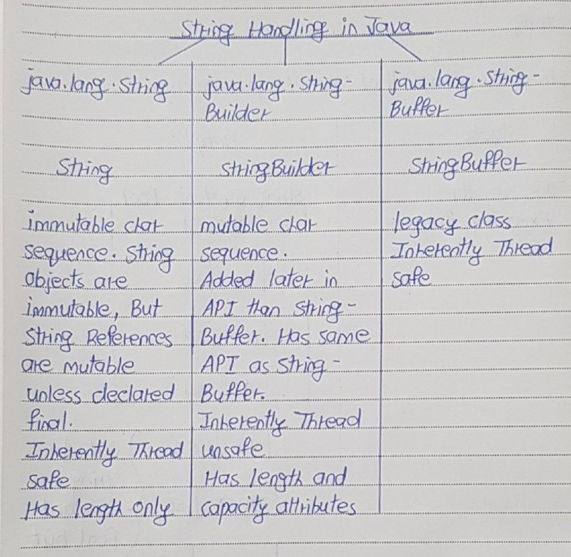

# Difference of StringBuilder and StringBuffer from String

- String objects created using java.lang.String class are immutable. Once they are created, they can not be modified. 
- If you try to modify them, a new string object will be created with modified content. 
- This property of String class may cause some memory issues for applications which need frequent modification of string objects. 
- To overcome this behavior of String class, two more classes are introduced in Java to represent the strings. They are StringBuffer and StringBuilder. 
- Both these classes are also members of  java.lang package same as String class.



The Difference Between String and StringBuilder, StringBuffer can be done on following parameters : 

- Immutability
- Object Creation
- Storage Area
- Thread Safety
- Performance
- String Concatenation
- equals() and hashCode() Methods
- toString() Method

## Immutability 

- This is main reason why StringBuffer and StringBuilder are introduced. 
- As objects of String class are immutable, objects of StringBuffer and StringBuilder class are mutable. 
- You can change the contents of StringBuffer and StringBuider objects at any time of execution. 
- When you change the content, new objects are not created. 
- Instead of that the changes are applied to existing object. 
- Thus solving memory issues may caused by String class.


## Object Creation

- You have to use ‘new‘ operator to create objects to StringBuffer and StringBuilder classes. 
- You can’t use string literals to create objects to these classes. 
- For example, you can’t write StringBuffer sb = “JAVA” or StringBuilder sb = “JAVA”. It gives compile time error. 
- But, you can use both string literals and new operator to create objects to String class.

## Storage Area

- As objects of StringBuffer and StringBuilder are created using only new operator, they are stored in heap memory. 
- Where as objects of String class are created using both string literals and new operator, they are stored in string constant pool as well as heap memory.

## Thread Safety

- Any immutable object in java is thread safe. Because they are unchangeable once they are created. 
- Any type of thread can’t change the content of immutable object. 
- This applies to objects of String class also. 
- Of the StringBuffer and StringBuilder objects, only StringBuffer objects are thread safe. 
- All necessary methods in StringBuffer class are synchronized so that only one thread can enter into it’s object at any point of time. 
- Where as StringBuilder objects are not thread safe.

## Performance 

- Because of thread safety property of String and StringBuffer classes, they reduces the performance of multithreaded applications. 
- Because, multiple threads can’t enter into objects of these classes simultaneously. One thread has to wait until another thread is finished with them. 
- But, you will not find performance problems if you use StringBuilder class. 
- Becuase, multiple threads can enter into objects of this class. 
- But, be aware that StringBuilder is not thread safety.

## String Concatenation

- There will be serious performance issues when you are performing lots of string concatenation using String class. 
- This is because, each time you perform string concatenation using string class, a new object will be created with the concatenated string. 
- This slows down an application. But, if you use either StringBuffer or StringBuilder instead of String class, your application will perform better. 

Below program shows time taken by all three classes to perform string concatenation 10000 times.
```
public class StringExamples
{
    public static void main(String[] args)
    {
        String s = "JAVA";
         
        long startTime = System.currentTimeMillis();
         
        for(int i = 0; i <= 10000; i++)
        {
            s = s + "J2EE";
        }
         
        long endTime = System.currentTimeMillis();
         
        System.out.println("Time taken by String class : "+(endTime - startTime)+" ms");
        // Time taken by String class : 429 ms

        StringBuffer sb = new StringBuffer("JAVA");
         
        startTime = System.currentTimeMillis();
         
        for(int i = 0; i <= 10000; i++)
        {
            sb.append("J2EE");
        }
         
        endTime = System.currentTimeMillis();
         
        System.out.println("Time taken by StringBuffer class : "+(endTime - startTime)+" ms");
        // Time taken by StringBuffer class : 2 ms

        StringBuilder sb1 = new StringBuilder("JAVA");
         
        startTime = System.currentTimeMillis();
         
        for(int i = 0; i <= 10000; i++)
        {
            sb1.append("J2EE");
        }
         
        endTime = System.currentTimeMillis();
         
        System.out.println("Time taken by StringBuilder class : "+(endTime - startTime)+" ms");
        // Time taken by StringBuilder class : 0 ms
    }
}
```
Output :
Time taken by String class : 429 ms
Time taken by StringBuffer class : 2 ms
Time taken by StringBuilder class : 0 ms

Therefore, when you are performing lots of string concatenation in your application, it is better to use StringBuffer class (if you need thread safety) or StringBuilder class (If you don’t need thread safety).

## equals() and hashCode() Methods 

In StringBuffer and StringBuilder classes, equals() and hashCode methods are not overrided. Where as in String class they are overrided.

## toString() Method

toString() method is overrided in all three classes. You can also convert StringBuffer and StringBuilder objects to String type by calling toString() method on them.

