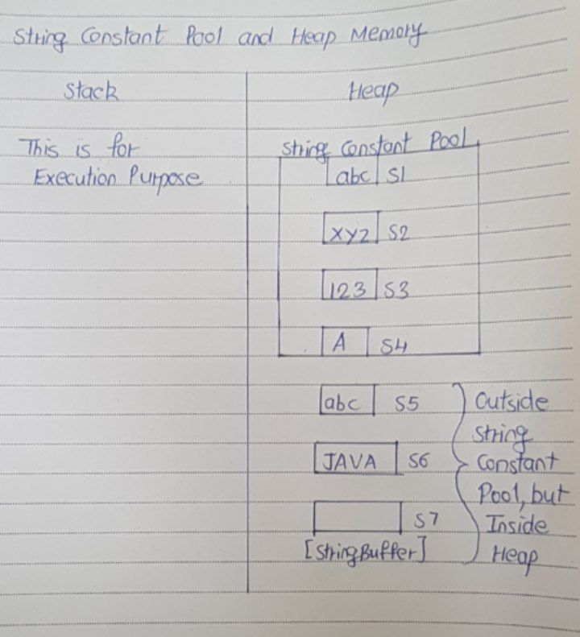

# How The Strings Are Stored In The Memory

In Java to create the string objects you need not to use ‘new‘ keyword.
Where as to create other type of objects you have to use ‘new’ keyword.
This attention is worth the while, because the strings are used almost everywhere while developing any kind of applications.

We all know that JVM divides the allocated memory to a Java program into two parts, one is Stack and another one is heap. 
Stack is used for execution purpose and heap is used for storage purpose. 
In that heap memory, JVM allocates some memory specially meant for string literals. This part of the heap memory is called String Constant Pool.

Whenever you create a string object using string literal, that object is stored in the string constant pool and whenever you create a string object using new keyword, such object is stored in the heap memory.

For example, when you create string objects like below, they will be stored in the String Constant Pool.
```
String s1 = "abc"; 
 
String s2 = "xyz";
 
String s3 = "123";
 
String s4 = "A";
```

And when you create string objects using new keyword like below, they will be stored in the heap memory.
```
String s5 = new String("abc");
 
char[] c = {'J', 'A', 'V', 'A'};
 
String s6 = new String(c);
 
String s7 = new String(new StringBuffer());
```

This is how String Constant Pool looks like in the memory.


One more interesting thing about String Constant Pool is that, pool space is allocated to an object depending upon it’s content. There will be no two objects in the pool having the same content.

This is what happens when you create string objects using string literal,
“When you create a string object using string literal, JVM first checks the content of to be created object. If there exist an object in the pool with the same content, then it returns the reference of that object. It doesn’t create new object. If the content is different from the existing objects then only it creates new object.”


But, when you create string objects using new keyword, a new object is created whether the content is same or not.

This can be proved by using “==” operator. As “==” operator returns true if two objects have same physical address in the memory otherwise it will return false. In the below example, s1 and s2 are created using string literal “abc”. So, s1 == s2 returns true. Where as s3 and s4 are created using new operator having the same content. But, s3 == s4 returns false.
```
public class StringExamples
{
    public static void main(String[] args)
    {
        //Creating string objects using literals
 
        String s1 = "abc";
 
        String s2 = "abc";
 
        System.out.println(s1 == s2);        //Output : true
 
        //Creating string objects using new operator
 
        String s3 = new String("abc");
 
        String s4 = new String("abc");
 
        System.out.println(s3 == s4);        //Output : false
    }
}
```

In simple words, there can not be two string objects with same content in the string constant pool. But, there can be two string objects with the same content in the heap memory.